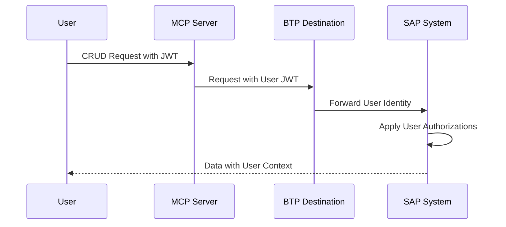
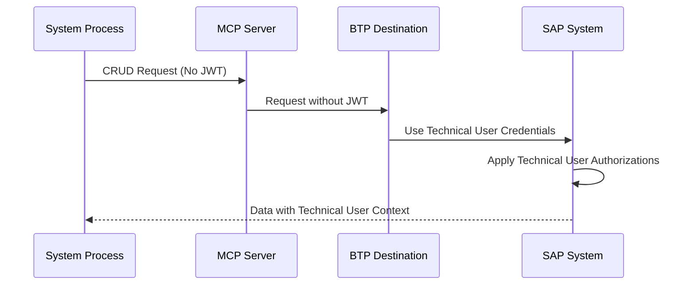

# 🔐 Hybrid Authentication Setup Guide

## **Runtime Destination with Principal Propagation + BasicAuth Fallback**

Yes! The runtime destination can support **both Principal Propagation AND BasicAuthentication** for maximum flexibility and resilience.

## 🏗️ **Architecture Benefits**

```
┌─────────────────────────────────────────────────────────────────┐
│                    Runtime Destination                         │
│                   (SAP_SYSTEM_RT)                              │
├─────────────────────────────────────────────────────────────────┤
│  Primary: Principal Propagation                                │
│  ├─ User JWT available → Forward user identity                 │
│  ├─ User-specific authorizations                               │
│  └─ Complete audit trail                                       │
│                                                                 │
│  Fallback: BasicAuthentication                                 │
│  ├─ No JWT token → Use technical user credentials              │
│  ├─ System continues to function                               │
│  └─ Graceful degradation                                       │
└─────────────────────────────────────────────────────────────────┘
```

## 🛠️ **BTP Destination Configuration**

### **Hybrid Runtime Destination**
```json
{
  "Name": "SAP_SYSTEM_RT",
  "Type": "HTTP",
  "URL": "https://your-sap-system.com",
  "Authentication": "PrincipalPropagation",
  "User": "RUNTIME_FALLBACK_USER", 
  "Password": "RUNTIME_FALLBACK_PASSWORD",
  "ProxyType": "Internet",
  "Description": "Hybrid: Principal Propagation with BasicAuth fallback"
}
```

### **Configuration Properties**
| Property | Purpose | Value |
|----------|---------|-------|
| `Authentication` | Primary auth method | `PrincipalPropagation` |
| `User` | Fallback username | Technical user for fallback |
| `Password` | Fallback password | Technical user password |

## 🔄 **Authentication Flow**

### **Scenario 1: User Context Available (Principal Propagation)**


### **Scenario 2: No User Context (BasicAuth Fallback)**


## 📋 **Implementation Examples**

### **1. Create Hybrid Destination**
```bash
# In BTP Cockpit, create destination with both auth methods:
# - Authentication: PrincipalPropagation  
# - Also add User and Password for fallback
```

### **2. Deploy with Hybrid Support**
```bash
cf deploy ./mta_archives/btp-sap-odata-to-mcp-server-optimized_1.0.0.mtar

# Configure environment
cf set-env sap-mcp-server-dev SAP_DESTINATION_NAME "SAP_SYSTEM"
cf set-env sap-mcp-server-dev SAP_DESTINATION_NAME_RT "SAP_SYSTEM_RT"  
cf set-env sap-mcp-server-dev SAP_USE_SINGLE_DESTINATION "false"

cf restart sap-mcp-server-dev
```

### **3. Verify Hybrid Authentication**
The admin dashboard will show:
- **Auth:** PrincipalPropagation  
- **🔒 Hybrid:** Principal Propagation + BasicAuth fallback

## 🔍 **Authentication Decision Logic**

### **Runtime Operation Flow:**
1. **Check for JWT token** (user context)
   - From current request context
   - From authentication session
   - From technical user token

2. **If JWT available:** Use Principal Propagation
   - Forward user identity to SAP system
   - Apply user-specific authorizations
   - Create audit trail with real user

3. **If no JWT:** Fallback to BasicAuth
   - Use technical user credentials configured in destination
   - Log warning about fallback usage
   - System continues to function

## ⚙️ **Configuration Examples**

### **Production Setup (Recommended)**
```bash
cf create-user-provided-service mcp-odata-config -p '{
  "SAP_DESTINATION_NAME": "SAP_SYSTEM",
  "SAP_DESTINATION_NAME_RT": "SAP_SYSTEM_RT_HYBRID",
  "SAP_USE_SINGLE_DESTINATION": "false"
}'
```

### **Development Setup (Simplified)**
```bash
# Use same destination for both (BasicAuth only)
cf set-env app SAP_USE_SINGLE_DESTINATION "true"
cf set-env app SAP_DESTINATION_NAME "SAP_SYSTEM_DEV"
```

## 🚦 **Authentication Scenarios**

### **✅ Supported Combinations**

| Scenario | Design-Time | Runtime | Use Case |
|----------|-------------|---------|----------|
| **Enterprise** | BasicAuth | PrincipalProp + BasicAuth | Production with user context |
| **Development** | BasicAuth | BasicAuth | Development/testing |
| **Technical** | BasicAuth | PrincipalProp only | Service-to-service |
| **Hybrid** | BasicAuth | PrincipalProp + BasicAuth | Maximum flexibility |

### **🔧 Authentication Priority**
1. **User JWT** (Principal Propagation)
2. **Session JWT** (Web interface)  
3. **Technical JWT** (Service account)
4. **BasicAuth Fallback** (Destination credentials)

## 📊 **Monitoring & Debugging**

### **Admin Dashboard Indicators**
- ✅ **Available** - Destination is reachable
- 🔒 **Hybrid** - Both authentication methods configured
- **Auth: PrincipalPropagation** - Primary authentication method

### **Log Messages**
```log
INFO: Using current user JWT for Principal Propagation
INFO: No JWT token available - will use BasicAuthentication fallback
DEBUG: Destination 'SAP_SYSTEM_RT' supports hybrid authentication
```

## ⚠️ **Best Practices**

### **Security**
1. **Minimal permissions** for fallback technical user
2. **Regular credential rotation** for technical users
3. **Monitor authentication methods** used in practice
4. **Audit trail analysis** to track Principal Propagation usage

### **Operational**
1. **Test both authentication paths** during deployment
2. **Monitor fallback usage** - high fallback rates may indicate JWT issues
3. **Configure appropriate timeouts** for both auth methods
4. **Document fallback user permissions** clearly

### **Development**
1. **Test without user context** to verify fallback works
2. **Test with different user roles** for Principal Propagation  
3. **Verify audit trails** show correct user identity
4. **Performance test** both authentication paths

## 🔧 **Troubleshooting**

### **Common Issues**

#### **Fallback Always Used**
```log
WARN: No JWT token available for runtime destination - will use BasicAuthentication fallback
```
**Solutions:**
- Check user authentication flow
- Verify JWT token extraction
- Test authentication session validity

#### **Principal Propagation Fails**
**Check:**
- SAML IdP configuration
- User mapping in SAP system  
- JWT token format and validity
- Destination configuration

#### **Fallback Fails**
**Check:**
- Technical user credentials
- User authorization in SAP system
- Destination connectivity

## 📈 **Performance Considerations**

- **Principal Propagation:** Higher security, user-specific data
- **BasicAuth Fallback:** Faster, cached credentials, broader permissions
- **Hybrid Benefit:** Best of both worlds with graceful degradation

This hybrid approach provides maximum flexibility while maintaining security and reliability! 🎯