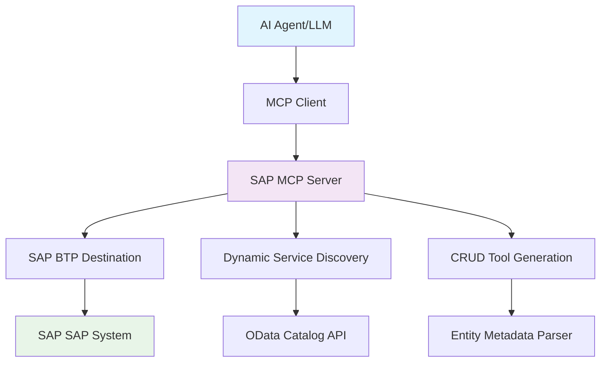

# SAP OData to MCP Server for BTP🚀

## 🎯 **Project Goal**

Transform your SAP S/4HANA or ECC system into a **conversational AI interface** by exposing all OData services as dynamic MCP tools. This enables natural language interactions with your ERP data:

- **"Show me 10 banks"** → Automatically queries the Bank entity with $top=10
- **"Update bank with ID 1 to have street number 5"** → Executes PATCH operation on Bank entity
- **"Create a new customer with name John Doe"** → Performs POST to Customer entity
- **"List all purchase orders from this week"** → Applies $filter for date range on PurchaseOrder entity

## 🏗️ **Architecture Overview**



### **Core Components:**

1. **🔍 Service Discovery Engine**: Automatically discovers all available OData services from SAP
2. **⚙️ Dynamic Tool Generator**: Creates MCP tools for CRUD operations on each discovered entity
3. **🔌 MCP Protocol Layer**: Full compliance with MCP 2025-06-18 specification
4. **🌐 HTTP Transport**: Session-based Streamable HTTP for web applications
5. **🔐 BTP Integration**: Seamless authentication via SAP BTP Destination service

## ✨ **Key Features**

### **🎨 Natural Language to OData**
- **Smart Query Translation**: Converts natural language to proper OData queries
- **Context-Aware Operations**: Understands entity relationships and constraints
- **Parameter Inference**: Automatically maps user intent to tool parameters

### **🔄 Dynamic CRUD Operations**
- **Read Operations**: Entity sets with filtering, sorting, pagination
- **Create Operations**: New entity creation with validation
- **Update Operations**: Partial and full entity updates
- **Delete Operations**: Safe entity deletion with confirmation

### **🚀 Production-Ready**
- **Session Management**: Automatic session creation and cleanup
- **Error Handling**: Comprehensive error handling with user-friendly messages
- **Logging**: Detailed logging for debugging and monitoring
- **Security**: DNS rebinding protection, CORS, Helmet security

### **📊 Real-Time Metadata**
- **Service Catalog**: Live discovery of available services
- **Entity Schemas**: Dynamic schema generation from OData metadata
- **Capability Detection**: Automatic detection of CRUD capabilities per entity

## 🏛️ **System Architecture**

```
┌─────────────────────┐    ┌───────────────────────────┐    ┌─────────────────────┐
│                     │    │                           │    │                     │
│   🤖 AI Agent       │    │   🖥️  SAP MCP Server     │    │   🏢 SAP            │
│   - Claude          │◄──►│   - Service Discovery     │◄──►│   - OData Services  │
│   - GPT-4           │    │   - CRUD Tool Registry    │    │   - Business Logic  │
│   - Local LLMs      │    │   - Session Management    │    │   - Master Data     │
│                     │    │   - BTP Authentication    │    │                     │
└─────────────────────┘    └───────────────────────────┘    └─────────────────────┘
                                           │                                       
                                           ▼                                       
                           ┌───────────────────────────┐                          
                           │                           │                          
                           │   ☁️  SAP BTP Platform    │                          
                           │   - Destination Service   │                          
                           │   - Connectivity Service  │                          
                           │   - XSUAA Security        │                          
                           │                           │                          
                           └───────────────────────────┘                          
```

## 🎯 **Use Cases**

### **📈 Business Intelligence Queries**
```
User: "Show me top 10 customers by revenue this quarter"
→ Tool: r-CustomerService-Customer
→ Parameters: $filter, $orderby, $top
```

### **📝 Data Maintenance**
```
User: "Update supplier ABC123 to have status 'Active'"
→ Tool: u-SupplierService-Supplier
→ Parameters: SupplierId="ABC123", Status="Active"
```

### **📊 Analytical Insights**
```
User: "How many open purchase orders are there?"
→ Tool: r-PurchaseOrderService-PurchaseOrder
→ Parameters: $filter=Status eq 'Open'&$count=true
```

### **🔧 System Administration**
```
User: "List all inactive users in the system"
→ Tool: r-UserService-User
→ Parameters: $filter=Status eq 'Inactive'
```

## 🛠️ **Installation & Setup**

### **Prerequisites**
- Node.js 18.x or higher
- SAP S/4HANA or ECC system with OData services enabled  
- SAP BTP account with Destination and Connectivity services
- TypeScript knowledge for customization

## 🚀 **Usage Examples**

### **Natural Language Queries**

The MCP server automatically translates these natural language commands to the appropriate tool calls:

| **Natural Language** | **Generated Tool Call** | **OData Query** |
|---------------------|------------------------|-----------------|
| "Show me 10 banks" | `r-BankService-Bank` | `GET /BankSet?$top=10` |
| "Find banks in Germany" | `r-BankService-Bank` | `GET /BankSet?$filter=Country eq 'DE'` |
| "Update bank 123 name to ABC Corp" | `u-BankService-Bank` | `PATCH /BankSet('123')` |
| "Create a new customer John Doe" | `c-CustomerService-Customer` | `POST /CustomerSet` |
| "Delete order 456" | `d-OrderService-Order` | `DELETE /OrderSet('456')` |

## 📋 **Available Tools**

### **Tool Naming Convention**

```text
{operationAbbreviation}-{serviceId}-{entityName}
```

Where operationAbbreviation is:

- r: read (query entities or get single entity)
- c: create (create new entity)
- u: update (update existing entity)
- d: delete (delete entity)

Examples:

- r-API_BUSINESS_PARTNER-BusinessPartner
- c-API_CUSTOMER_MATERIAL_SRV-CustomerMaterial
- u-API_SALES_ORDER_SRV-SalesOrder
- d-API_SALES_ORDER_SRV-SalesOrder

### **CRUD Operations**
### **Protocol Version**: 2025-06-18
### **Supported Capabilities**:
- ✅ **Tools** with `listChanged` notifications
- ✅ **Resources** with `listChanged` notifications  
- ✅ **Logging** with level control
- ✅ **Session Management** for HTTP transport
- ✅ **Error Handling** with proper error codes

### **Transport Support**

- ✅ **Streamable HTTP** (recommended)
- ✅ **Stdio** for command line usage
- ✅ **Session-based** with automatic cleanup
- ✅ **DNS Rebinding Protection**

## 🔒 **Security & Authentication**

### **SAP BTP Integration**

- Uses BTP Destination service for S/4HANA or ECC authentication
- Supports Principal Propagation and OAuth2
- Automatic token refresh and session management
- Secure credential storage in BTP

### **HTTP Security**

- Helmet.js security headers
- CORS protection with configurable origins
- DNS rebinding attack prevention
- Request rate limiting (configurable)

### **Session Security**

- Automatic session expiration (24h default)
- Secure session ID generation
- Session cleanup on server restart
- Memory leak prevention

## 📚 **API Reference**

### **Health Check**

```http
GET /health
{
  "status": "healthy",
  "activeSessions": 3,
  "discoveredServices": 25,
  "version": "2.0.0"
}
```

### **Server Info**

```http
GET /mcp
{
  "name": "btp-sap-odata-to-mcp-server",
  "protocol": { "version": "2025-06-18" },
  "capabilities": { "tools": {}, "resources": {} },
  "features": ["Dynamic service discovery", "CRUD operations"],
  "activeSessions": 3
}
```

### **Documentation**

```http
GET /docs
{
  "title": "SAP MCP Server API",
  "endpoints": {...},
  "mcpCapabilities": {...},
  "usage": {...}
}
```

## 🎬 Demo

See the MCP server in action:


## ⚙️ Environment Variable: Disable ReadEntity Tool Registration

To disable registration of the ReadEntity tool for all entities in all services, set the following in your `.env` file:

```env
DISABLE_READ_ENTITY_TOOL=true
```
This will prevent registration of the ReadEntity tool for all entities and services.

## 🔧 **Dynamic OData Service Configuration**

### **Overview**

The MCP server supports dynamic OData service discovery configuration that can be updated without rebuilding or redeploying the application. This is achieved through Cloud Foundry environment variables and user-provided services.

### **Configuration Methods**

#### **Method 1: Cloud Foundry Environment Variables**

Set environment variables directly on your CF application:

```bash
# Set service patterns to discover only custom Z services and API services
cf set-env your-app-name ODATA_SERVICE_PATTERNS "Z*,*API*"

# Exclude test and temporary services
cf set-env your-app-name ODATA_EXCLUSION_PATTERNS "*_TEST*,*_TEMP*"

# Set maximum services to discover
cf set-env your-app-name ODATA_MAX_SERVICES "100"

# Restart the application to apply changes
cf restart your-app-name
```

#### **Method 2: User-Provided Services** (Recommended)

Create a user-provided service for more complex configuration:

```bash
# Create user-provided service with JSON configuration
cf create-user-provided-service odata-config -p '{
  "ODATA_SERVICE_PATTERNS": ["Z*", "*API*", "C_*"],
  "ODATA_EXCLUSION_PATTERNS": ["*_TEST*", "*_DEBUG*"],
  "ODATA_ALLOW_ALL": "false",
  "ODATA_MAX_SERVICES": "50",
  "ODATA_DISCOVERY_MODE": "whitelist"
}'

# Bind the service to your application
cf bind-service your-app-name odata-config

# Restart to apply the binding
cf restart your-app-name
```

#### **Method 3: Runtime Configuration Reload** (No Restart Required)

Use the admin dashboard to reload configuration without restarting:

1. **Access Admin Dashboard**: Navigate to `/admin` on your deployed application
2. **Authenticate**: Use your SAP IAS credentials
3. **OData Configuration Management**: Click "Reload Services" button
4. **Verify**: Check the updated service count and patterns

### **Configuration Parameters**

| **Parameter** | **Description** | **Default** | **Example** |
|---------------|----------------|-------------|-------------|
| `ODATA_ALLOW_ALL` | Allow all services (`true`/`false`) | `false` | `false` |
| `ODATA_SERVICE_PATTERNS` | Service inclusion patterns | `["*"]` | `["Z*", "*API*"]` |
| `ODATA_EXCLUSION_PATTERNS` | Service exclusion patterns | `[]` | `["*_TEST*"]` |
| `ODATA_MAX_SERVICES` | Maximum services to discover | `50` | `100` |
| `ODATA_DISCOVERY_MODE` | Discovery mode | `whitelist` | `whitelist` |

### **Pattern Syntax**

#### **Glob Patterns** (Recommended)
```bash
Z*              # All services starting with 'Z'
*API*           # All services containing 'API'
API_*_SRV       # Services like 'API_SALES_SRV'
```

#### **Regex Patterns** (Advanced)
```bash
/^Z(BP|TRANSPORT|BC_UI_PARAM_E_CDS).*/    # Complex regex pattern
/API_.*/                                  # Services starting with 'API_'
```

#### **JSON Array Format**
```json
["Z*", "*API*", "/^C_.*_CDS$/"]
```

### **Configuration Priority**

Configuration is loaded in this priority order:

1. **User-Provided Services** (`odata-config` or `mcp-odata-config`)
2. **Cloud Foundry Environment Variables**  
3. **Local `.env` File** (development only)

### **Configuration Examples**

#### **Example 1: Only Custom Z Services**
```bash
cf set-env my-mcp-server ODATA_SERVICE_PATTERNS "Z*"
cf set-env my-mcp-server ODATA_EXCLUSION_PATTERNS "*_TEST*"
```

#### **Example 2: API and Customer Services**
```bash
cf create-user-provided-service odata-config -p '{
  "ODATA_SERVICE_PATTERNS": ["*API*", "C_CUSTOMER*"],
  "ODATA_MAX_SERVICES": "25"
}'
```

#### **Example 3: All Services with Exclusions**
```bash
cf create-user-provided-service odata-config -p '{
  "ODATA_ALLOW_ALL": "true",
  "ODATA_EXCLUSION_PATTERNS": ["*_TEST*", "*_DEBUG*", "*_TEMP*"]
}'
```

### **Managing Configuration Changes**

#### **Option A: Environment Variables (Requires Restart)**
```bash
# Update configuration
cf set-env my-app ODATA_SERVICE_PATTERNS "Z*,API_SALES*"

# Apply changes
cf restart my-app
```

#### **Option B: User-Provided Services (Requires Restart)**
```bash
# Update service configuration
cf update-user-provided-service odata-config -p '{
  "ODATA_SERVICE_PATTERNS": ["Z*", "API_SALES*"],
  "ODATA_MAX_SERVICES": "75"
}'

# Apply changes
cf restart my-app
```

#### **Option C: Runtime Reload (No Restart Required)** ⭐
```bash
# 1. Update CF configuration (environment variables or user-provided service)
cf set-env my-app ODATA_SERVICE_PATTERNS "Z*,NEW_API*"

# 2. Use admin dashboard to trigger reload (no restart needed)
# Navigate to /admin → OData Configuration → Click "Reload Services"
```

### **Monitoring Configuration Changes**

#### **Admin Dashboard**
- **Real-time Service Count**: View current discovered services
- **Configuration Display**: See active patterns and settings
- **Reload History**: Track configuration reload attempts
- **Service Details**: Browse discovered services by pattern

#### **Application Logs**
```bash
# View configuration reload logs
cf logs my-mcp-server --recent | grep "OData"

# Expected output:
# ✅ Loaded OData configuration from CF user-provided service
# 🔄 Reloading OData configuration and rediscovering services...
# ✅ Service rediscovery complete: 23 services found
```

### **Troubleshooting**

#### **Service Not Discovered**
```bash
# Check current configuration
cf env my-app | grep ODATA

# Verify patterns match your services
# Use admin dashboard to view discovered services
# Check application logs for discovery errors
```

#### **Too Many Services**
```bash
# Reduce service count with more specific patterns
cf set-env my-app ODATA_SERVICE_PATTERNS "Z_SPECIFIC*"
cf set-env my-app ODATA_MAX_SERVICES "20"
```

#### **Configuration Not Applied**
```bash
# Ensure user-provided service is bound
cf services | grep odata-config

# Check if restart is needed
cf restart my-app

# Or use runtime reload via admin dashboard
```

## ⚡ Quick Start

- For local development and testing, see [LOCAL_RUN.md](./docs/LOCAL_RUN.md)
- For deployment to SAP BTP, see [DEPLOYMENT.md](./docs/DEPLOYMENT.md)
