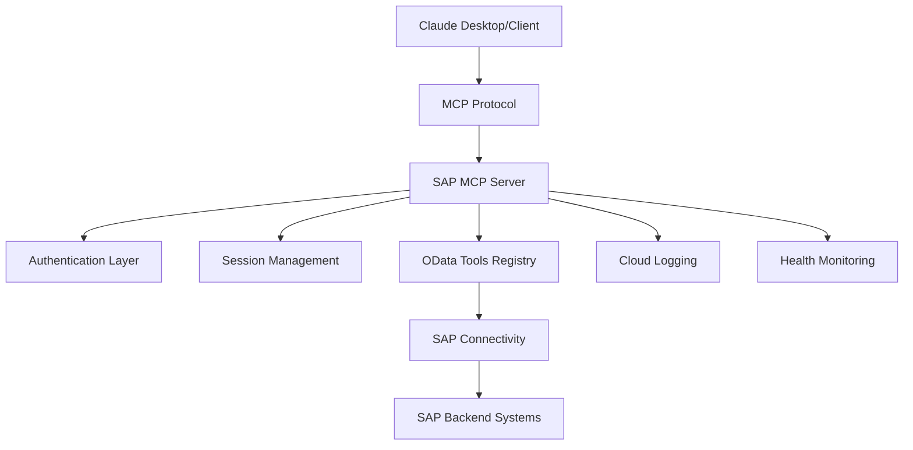
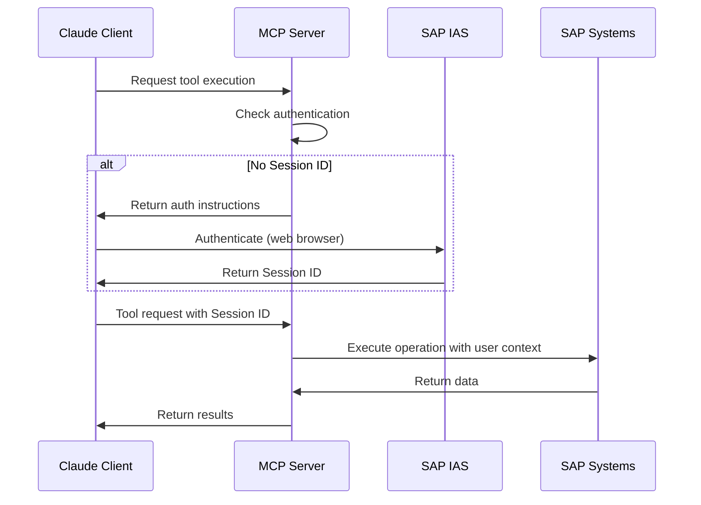

# SAP OData to MCP Server - Enhanced Playground

> **🔗 Original Project Reference**  
> This repository is a **playground** and **experimental enhancement** of the original project:  
> **[btp-sap-odata-to-mcp-server](https://github.com/lemaiwo/btp-sap-odata-to-mcp-server)** by [@lemaiwo](https://github.com/lemaiwo)
> 
> ⚡ **Goal**: Introduce and test new features that may eventually be integrated back into the original project.

## 🏗️ Enhanced Architecture & Features

This playground extends the original SAP BTP OData MCP Server with advanced features for enterprise-grade deployments:

### 🚀 New Features Added

- **🔐 Enhanced Authentication System**
  - Hybrid authentication (IAS + XSUAA)
  - Session management with auto-cleanup
  - Role-based access control (RBAC)
  - Principal propagation support

- **📊 Enterprise Monitoring & Logging**
  - SAP Cloud Logging integration
  - Structured JSON logging with correlation IDs
  - Health checks with detailed system status
  - Performance metrics and monitoring

- **🔄 Advanced Session Management**
  - User-specific session isolation
  - Automatic session expiration
  - Session persistence across deployments
  - Client-based session tracking

- **🛡️ Security Enhancements**
  - JWT token validation and refresh
  - Secure error handling with sanitization
  - Request/response validation
  - Security headers and CORS configuration

- **☁️ Cloud-Native Optimizations**
  - SAP BTP Cloud Foundry optimized deployment
  - Auto-scaling and resource management
  - Service discovery and binding automation
  - Graceful shutdown handling

## 📚 Documentation Structure

```
docs/
├── README.md                    # This file
├── ARCHITECTURE.md              # System architecture and design
├── CONFIGURATION.md             # Configuration guide
├── DEPLOYMENT.md               # Deployment instructions
├── API_REFERENCE.md            # API documentation
├── TROUBLESHOOTING.md          # Common issues and solutions
└── CHANGELOG.md                # Version history and changes
```

## 🎯 Quick Start

### Prerequisites

- SAP BTP Cloud Foundry environment
- SAP Identity Authentication Service (IAS)
- SAP Connectivity Service
- Node.js 18+ and npm

### 1. Clone and Install

```bash
git clone <this-repo>
cd btp-sap-odata-to-mcp-server-optimized
npm install
```

### 2. Configure Environment

Copy the example environment file and configure:

```bash
cp .env.example .env
```

Required environment variables:
```env
# SAP IAS Configuration
SAP_IAS_URL=https://your-tenant.accounts.ondemand.com
SAP_IAS_CLIENT_ID=your-client-id
SAP_IAS_CLIENT_SECRET=your-client-secret

# Server Configuration
PORT=8080
NODE_ENV=production
```

### 3. Deploy to SAP BTP

```bash
npm run build
cf push
```

### 4. Access the Application

- **Web Interface**: `https://your-app.cfapps.region.hana.ondemand.com/auth/`
- **MCP Connection**: Use the Session ID from the web interface
- **Health Check**: `https://your-app.cfapps.region.hana.ondemand.com/health`

## 🔧 Configuration

| Component | Status | Configuration File |
|-----------|--------|--------------------|
| Authentication | ✅ Ready | [CONFIGURATION.md#auth](docs/CONFIGURATION.md#authentication) |
| Cloud Logging | ✅ Ready | [CONFIGURATION.md#logging](docs/CONFIGURATION.md#logging) |
| Service Discovery | ✅ Ready | [CONFIGURATION.md#discovery](docs/CONFIGURATION.md#service-discovery) |
| Health Monitoring | ✅ Ready | [CONFIGURATION.md#health](docs/CONFIGURATION.md#health-checks) |

## 🏛️ Architecture Overview

### High-Level Architecture



### Component Architecture

- **MCP Protocol Layer**: Handles Model Context Protocol communication
- **Authentication Layer**: IAS/XSUAA hybrid authentication with session management  
- **Tools Registry**: Hierarchical SAP OData tools with caching
- **Connectivity Layer**: SAP BTP Connectivity Service integration
- **Monitoring Layer**: Health checks, logging, and observability

For detailed architecture information, see [ARCHITECTURE.md](docs/ARCHITECTURE.md).

## 📖 API Reference

### MCP Tools Available

| Tool | Description | Auth Required |
|------|-------------|---------------|
| `search-sap-services` | Discover available SAP OData services | No |
| `discover-service-entities` | Get entities for a specific service | No |
| `get-entity-schema` | Retrieve entity metadata and schema | No |
| `execute-entity-operation` | Perform CRUD operations on entities | Yes* |

*Requires Session ID for runtime operations

### Authentication Flow



## 🚀 Deployment

### SAP BTP Cloud Foundry

The application is optimized for SAP BTP Cloud Foundry with:

- **Automatic service binding** for Connectivity and XSUAA
- **SAP Cloud Logging** integration for centralized logging
- **Health checks** for monitoring and auto-recovery
- **Resource optimization** for efficient scaling

See [DEPLOYMENT.md](docs/DEPLOYMENT.md) for detailed deployment instructions.

### Local Development

```bash
npm run dev
```

The server will start at `http://localhost:8080` with hot reload enabled.

## 🔍 Monitoring & Observability

### Health Endpoints

- **`/health`**: Comprehensive health check with service status
- **`/auth/status`**: Authentication system status
- **Logs**: Structured JSON logs with correlation IDs

### SAP Cloud Logging Dashboard

Access centralized logs and metrics through the SAP Cloud Logging service dashboard.

## 🤝 Contributing

This is an experimental playground for testing enhancements to the original project:

1. **Test new features** in this environment
2. **Document improvements** and performance impacts
3. **Propose integration** back to the [original project](https://github.com/lemaiwo/btp-sap-odata-to-mcp-server)

### Development Workflow

1. Fork this playground repository
2. Create feature branches for new enhancements
3. Test thoroughly in SAP BTP environment
4. Document changes and performance impacts
5. Create pull request with detailed description

## 📄 License

This project follows the same license as the original project. Please refer to the [original repository](https://github.com/lemaiwo/btp-sap-odata-to-mcp-server) for licensing information.

## 🙏 Acknowledgments

- **[@lemaiwo](https://github.com/lemaiwo)** - Creator of the original SAP BTP OData MCP Server
- **SAP Community** - For comprehensive BTP documentation and best practices
- **Anthropic** - For the Model Context Protocol specification

## 🔗 Links

- **Original Project**: https://github.com/lemaiwo/btp-sap-odata-to-mcp-server
- **Model Context Protocol**: https://modelcontextprotocol.io/
- **SAP BTP Documentation**: https://help.sap.com/docs/btp
- **Claude Desktop**: https://claude.ai/desktop

---

**⚠️ Important**: This is a playground environment for testing enhancements. For production use cases, please refer to the [original stable project](https://github.com/lemaiwo/btp-sap-odata-to-mcp-server).