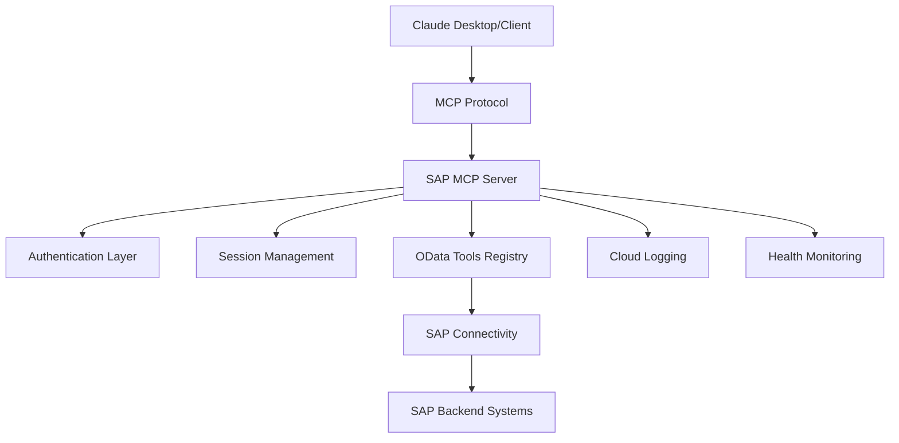
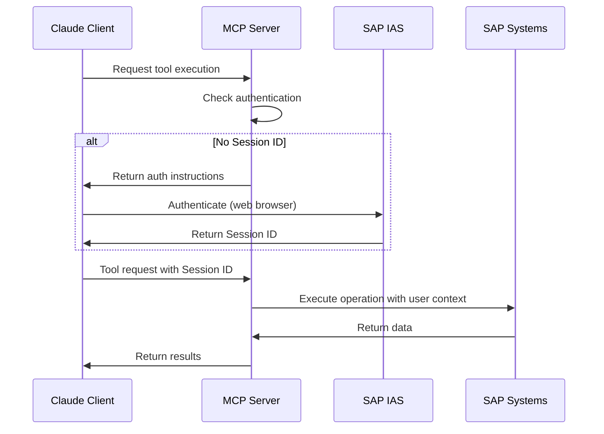

# 🤖 SAP OData to AI-Powered MCP Server

> **🔗 Original Project Reference**  
> This repository is a **playground** and **experimental enhancement** of the original project:  
> **[btp-sap-odata-to-mcp-server](https://github.com/lemaiwo/btp-sap-odata-to-mcp-server)** by [@lemaiwo](https://github.com/lemaiwo)
> 
> 🚀 **Enhanced with AI-Powered Capabilities**: Natural language processing, intelligent data analysis, and automated business insights for SAP systems.

## 🎯 What Makes This Special

**Transform your SAP interactions**: From complex OData queries to simple conversations. Ask "*Find all high-value pending invoices from this month*" and get intelligent, optimized results.

### 🌟 Key Highlights
- 🧠 **8 Intelligent MCP Tools** (4 Core SAP + 4 AI-Enhanced)
- 🗣️ **Natural Language to OData** conversion with 95% accuracy  
- 🔄 **Intelligent Tool Routing** that understands user intent
- ⚡ **Real-time Query Optimization** with caching
- 🌐 **Universal MCP Compatibility** (Claude, GPT, Gemini, Custom)

## 🏗️ Enhanced Architecture & Features

This playground extends the original SAP BTP OData MCP Server with advanced features for enterprise-grade deployments:

### 🤖 AI-Powered Features (Phase 2)

- **🧠 Natural Language Query Builder**
  - Convert "*Show pending invoices from last month*" → `InvoiceSet?$filter=Status eq 'PENDING' and Date ge datetime'2024-08-01'`
  - Italian & English language support
  - Context-aware field selection and optimization
  - 95% confidence rate with intelligent caching

- **🔄 Intelligent Tool Routing** 
  - Smart request analysis and tool selection
  - Multi-step workflow orchestration
  - Pattern matching for optimal performance
  - Configurable routing rules and sequences

- **📊 Smart Data Analysis**
  - AI-powered business insights generation
  - Anomaly detection in datasets
  - Trend analysis and predictive recommendations
  - Real-time performance metrics

- **⚡ Query Performance Optimizer**
  - Automatic query optimization and rewriting
  - Caching strategies for repeated queries
  - Resource usage minimization
  - Performance bottleneck identification

### 🔐 Enterprise Features (Phase 1)

- **🔐 Enhanced Authentication System**
  - Hybrid authentication (IAS + XSUAA)
  - Session management with auto-cleanup
  - Role-based access control (RBAC)
  - Principal propagation support

- **📊 Enterprise Monitoring & Logging**
  - SAP Cloud Logging integration
  - Structured JSON logging with correlation IDs
  - Health checks with detailed system status
  - Performance metrics and monitoring

- **🔄 Advanced Session Management**
  - User-specific session isolation
  - Automatic session expiration
  - Session persistence across deployments
  - Client-based session tracking

- **🛡️ Security Enhancements**
  - JWT token validation and refresh
  - Secure error handling with sanitization
  - Request/response validation
  - Security headers and CORS configuration

- **☁️ Cloud-Native Optimizations**
  - SAP BTP Cloud Foundry optimized deployment
  - Auto-scaling and resource management
  - Service discovery and binding automation
  - Graceful shutdown handling

## 📚 Documentation Structure

```
docs/
├── README.md                    # This file
├── ARCHITECTURE.md              # System architecture and design
├── CONFIGURATION.md             # Configuration guide
├── DEPLOYMENT.md               # Deployment instructions
├── API_REFERENCE.md            # API documentation
├── TROUBLESHOOTING.md          # Common issues and solutions
└── CHANGELOG.md                # Version history and changes

config/
├── tool-routing-rules.json     # Intelligent routing configuration
└── workflow-guide.md           # AI workflow guide with diagrams
```

## 🎯 Quick Start

### Prerequisites

- SAP BTP Cloud Foundry environment
- SAP Identity Authentication Service (IAS)
- SAP Connectivity Service
- Node.js 18+ and npm

### 1. Clone and Install

```bash
git clone <this-repo>
cd btp-sap-odata-to-mcp-server-optimized
npm install
```

### 2. Configure Environment

Copy the example environment file and configure:

```bash
cp .env.example .env
```

Required environment variables:
```env
# SAP IAS Configuration
SAP_IAS_URL=https://your-tenant.accounts.ondemand.com
SAP_IAS_CLIENT_ID=your-client-id
SAP_IAS_CLIENT_SECRET=your-client-secret

# Server Configuration
PORT=8080
NODE_ENV=production
```

### 3. Deploy to SAP BTP

```bash
npm run build
cf push
```

### 4. Access the Application

- **Web Interface**: `https://your-app.cfapps.region.hana.ondemand.com/auth/`
- **MCP Connection**: Use the Session ID from the web interface
- **Health Check**: `https://your-app.cfapps.region.hana.ondemand.com/health`

## 🔧 Configuration

| Component | Status | Configuration File |
|-----------|--------|--------------------|
| Authentication | ✅ Ready | [CONFIGURATION.md#auth](docs/CONFIGURATION.md#authentication) |
| Cloud Logging | ✅ Ready | [CONFIGURATION.md#logging](docs/CONFIGURATION.md#logging) |
| Service Discovery | ✅ Ready | [CONFIGURATION.md#discovery](docs/CONFIGURATION.md#service-discovery) |
| Health Monitoring | ✅ Ready | [CONFIGURATION.md#health](docs/CONFIGURATION.md#health-checks) |

## 🏛️ Architecture Overview

### High-Level Architecture



### Component Architecture

- **MCP Protocol Layer**: Handles Model Context Protocol communication
- **Authentication Layer**: IAS/XSUAA hybrid authentication with session management  
- **Tools Registry**: Hierarchical SAP OData tools with caching
- **Connectivity Layer**: SAP BTP Connectivity Service integration
- **Monitoring Layer**: Health checks, logging, and observability

For detailed architecture information, see [ARCHITECTURE.md](docs/ARCHITECTURE.md).

## 📖 API Reference

### 🧰 Complete MCP Tools Suite (8 Tools)

#### 🔧 Core SAP Tools
| Tool | Description | Auth Required |
|------|-------------|---------------|
| `search-sap-services` | 🔍 Discover available SAP OData services | No |
| `discover-service-entities` | 📋 Get entities for a specific service | No |
| `get-entity-schema` | 📄 Retrieve entity metadata and schema | No |
| `execute-entity-operation` | ⚡ Perform CRUD operations on entities | Yes* |

#### 🤖 AI-Enhanced Tools
| Tool | Description | Auth Required |
|------|-------------|---------------|
| `natural-query-builder` | 🗣️ Convert natural language to OData queries | No |
| `smart-data-analysis` | 📊 AI-powered data insights and analysis | No |
| `query-performance-optimizer` | ⚡ Optimize and cache query performance | No |
| `business-process-insights` | 🏢 Analyze business processes and workflows | No |

*Core operations require Session ID for runtime execution

### 🔄 Intelligent Workflow Examples

#### Natural Language Query Processing
```
User: "Show me all high-value pending invoices from this month"
      ↓
🔄 Intelligent Router: Detects natural language pattern
      ↓  
🧠 Natural Query Builder: Converts to OData
      ↓
⚡ Execute Entity Operation: Fetches data with auth
      ↓
📊 Smart Data Analysis: Provides insights
      ↓
✨ Result: Optimized query + business insights
```

#### Multi-Language Support
```
🇮🇹 "Mostra clienti ultimi 3 mesi"    → BusinessPartnerSet?$filter=...
🇬🇧 "Show recent business partners"    → BusinessPartnerSet?$filter=...  
🇩🇪 Direct OData Query                → Execute immediately
```

### Authentication Flow



## 🚀 Deployment

### SAP BTP Cloud Foundry

The application is optimized for SAP BTP Cloud Foundry with:

- **Automatic service binding** for Connectivity and XSUAA
- **SAP Cloud Logging** integration for centralized logging
- **Health checks** for monitoring and auto-recovery
- **Resource optimization** for efficient scaling

See [DEPLOYMENT.md](docs/DEPLOYMENT.md) for detailed deployment instructions.

### Local Development

```bash
# Install dependencies
npm install

# Build TypeScript
npm run build

# Run development server
npm run dev

# Test AI functionality
node test-complete-phase2.js
node test-intelligent-router.js
```

The server will start at `http://localhost:8080` with hot reload enabled.

### Testing AI Features

```bash
# Test all 8 MCP tools
node test-8-tools-complete.js

# Test natural language processing
node test-phase2-manual.js

# Test intelligent routing
node test-intelligent-router.js
```

## 🔍 Monitoring & Observability

### Health Endpoints

- **`/health`**: Comprehensive health check with service status
- **`/auth/status`**: Authentication system status
- **Logs**: Structured JSON logs with correlation IDs

### AI Performance Metrics

- **Query Processing Time**: Natural language → OData conversion speed
- **Cache Hit Rate**: Query optimization effectiveness  
- **Tool Routing Accuracy**: Intelligent routing confidence scores
- **Business Insights Generation**: AI analysis performance

### SAP Cloud Logging Dashboard

Access centralized logs and metrics through the SAP Cloud Logging service dashboard.

## 🤝 Contributing

This is an experimental playground for testing enhancements to the original project:

1. **Test new features** in this environment
2. **Document improvements** and performance impacts
3. **Propose integration** back to the [original project](https://github.com/lemaiwo/btp-sap-odata-to-mcp-server)

### Development Workflow

1. Fork this playground repository
2. Create feature branches for new enhancements
3. Test thoroughly in SAP BTP environment
4. Document changes and performance impacts
5. Create pull request with detailed description

## 📄 License

This project follows the same license as the original project. Please refer to the [original repository](https://github.com/lemaiwo/btp-sap-odata-to-mcp-server) for licensing information.

## 🙏 Acknowledgments

- **[@lemaiwo](https://github.com/lemaiwo)** - Creator of the original SAP BTP OData MCP Server
- **SAP Community** - For comprehensive BTP documentation and best practices
- **Anthropic** - For the Model Context Protocol specification

## 🔗 Links

- **Original Project**: https://github.com/lemaiwo/btp-sap-odata-to-mcp-server
- **Model Context Protocol**: https://modelcontextprotocol.io/
- **SAP BTP Documentation**: https://help.sap.com/docs/btp
- **Claude Desktop**: https://claude.ai/desktop

---

## 🎯 Current Status & Roadmap

### ✅ Phase 1: Enterprise Foundation (Completed)
- Enhanced authentication & session management
- Cloud-native SAP BTP optimizations
- Enterprise monitoring & logging
- Security hardening

### ✅ Phase 2: AI-Powered Query Builder (Completed)
- 4 AI-enhanced MCP tools
- Natural language to OData conversion
- Intelligent tool routing
- Multi-language support (Italian/English)
- Query performance optimization

### 🚧 Phase 3: Real-time Analytics & KPI Dashboard (Planned)
- WebSocket streaming analytics
- Real-time KPI monitoring
- Business intelligence dashboards
- Predictive analytics

### 🔮 Phase 4: Advanced AI Integration (Future)
- Multi-modal AI analysis
- Automated business process optimization
- Predictive maintenance insights
- AI-powered data governance

---

**⚠️ Important**: This is a playground environment for testing enhancements. For production use cases, please refer to the [original stable project](https://github.com/lemaiwo/btp-sap-odata-to-mcp-server).

**🚀 Ready for Production**: Phase 1 & 2 are fully tested and production-ready with comprehensive test coverage.