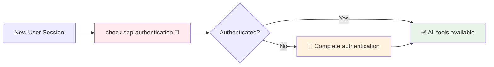
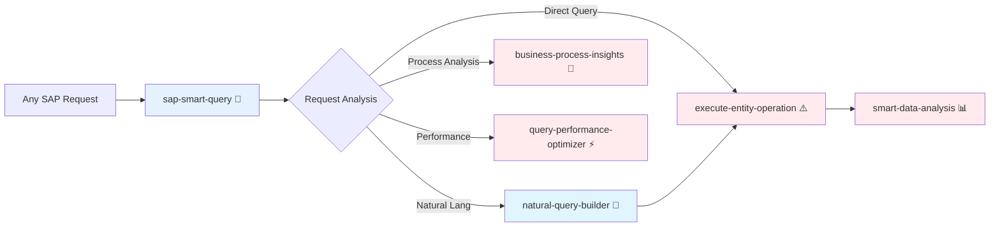
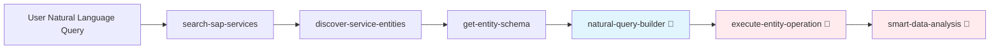
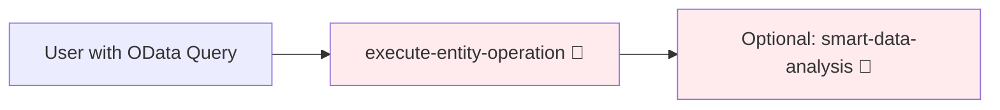
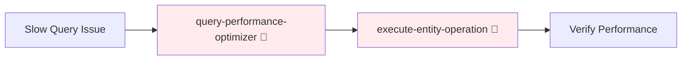

# 🎯 SAP MCP Tools - Workflow Configuration Guide

## 🎯 Available Tools Overview (10 Total)

### 🔐 Session Management
- **`check-sap-authentication`** - 🔐 SESSION: Validate user authentication and pre-authenticate for smooth workflows

### 🧠 Smart Routing  
- **`sap-smart-query`** - 🧠 SMART ROUTER: Single entry point with intelligent routing for any SAP request

### 🔍 Discovery Tools (No Auth Required)
- **`search-sap-services`** - 🔍 DISCOVERY: Find SAP services by category/keyword
- **`discover-service-entities`** - 📁 ENTITIES: List entities within specific services  
- **`get-entity-schema`** - 📋 SCHEMA: Get detailed entity structure and properties

### ⚡ Execution Tools (Auth Required)
- **`execute-entity-operation`** - ⚠️ DIRECT: Execute precise OData CRUD operations
- **`natural-query-builder`** - 🔄 PREFERRED: Convert natural language to OData queries

### 📊 Analytics Tools (Auth Required)
- **`smart-data-analysis`** - 📊 ANALYSIS: AI-powered data insights and trends
- **`business-process-insights`** - 🔄 PROCESS: Analyze workflows for bottlenecks  
- **`query-performance-optimizer`** - ⚡ OPTIMIZE: Optimize slow queries with AI

## 📊 Tool Routing Matrix

| User Intent | Session Start | Primary Tool | Authentication | Next Tool | Final Tool |
|-------------|--------------|--------------|----------------|-----------|------------|
| **🔄 New Session** | `check-sap-authentication` | - | 🔐 Proactive Check | Continue based on status | - |
| **🧠 Any SAP Request** | `sap-smart-query` | Auto-routes internally | Handled by specific tool | Based on routing | - |
| **🔍 Explore Services** | `search-sap-services` | `discover-service-entities` | ❌ No Auth | `get-entity-schema` | `execute-entity-operation` |
| "Show me customers from last month" | `natural-query-builder` | `execute-entity-operation` | ✅ Required | `smart-data-analysis` | - |
| "Analyze business partners created recently" | `natural-query-builder` | `execute-entity-operation` | ✅ Required | `smart-data-analysis` | - |
| "Find pending invoices" | `natural-query-builder` | `execute-entity-operation` | ✅ Required | - | - |
| "Optimize this slow query" | `query-performance-optimizer` | `execute-entity-operation` | ✅ Required | - | - |
| "Analyze procurement process" | `business-process-insights` | - | ✅ Required | - | - |
| Execute exact OData query | `execute-entity-operation` | - | ✅ Required | - | - |

## 🔄 Workflow Sequences

### Sequence 0: Session Initialization 


### Sequence 1: Smart Router (Recommended Entry Point)


### Sequence 2: Discovery Workflow

```mermaid
graph LR
    A[Explore SAP Data] --> B[search-sap-services 🔍]
    B --> C[discover-service-entities 📁]
    C --> D[get-entity-schema 📋]
    D --> E[natural-query-builder 🔄]
    E --> F[execute-entity-operation ⚠️]
    F --> G[smart-data-analysis 📊]
    
    style B fill:#e8f5e8
    style C fill:#e8f5e8
    style D fill:#e8f5e8
    style E fill:#e1f5fe
    style F fill:#ffebee
    style G fill:#ffebee
```


### Sequence 3: Natural Language Analytics


### Sequence 2: Direct Query Execution


### Sequence 3: Performance Optimization


## 📋 Tool Selection Rules

### 🎯 Primary Selection Logic

| User Input Pattern | Recommended Tool | Reason |
|-------------------|------------------|--------|
| Natural language (IT/EN) | `natural-query-builder` | Converts human language to OData |
| Contains "analizza", "mostra", "trova" | `natural-query-builder` | Italian natural language indicators |
| Contains "analyze", "show me", "find" | `natural-query-builder` | English natural language indicators |
| Exact OData syntax | `execute-entity-operation` | Direct query execution |
| "Performance", "slow", "optimize" | `query-performance-optimizer` | Query optimization needed |
| "Process", "workflow", "bottleneck" | `business-process-insights` | Process analysis required |

### ⚠️ Anti-Patterns (Avoid These)

| ❌ Wrong Pattern | ✅ Correct Pattern |
|-----------------|-------------------|
| `execute-entity-operation` with "mostra clienti" | `natural-query-builder` → `execute-entity-operation` |
| `smart-data-analysis` without data | `execute-entity-operation` → `smart-data-analysis` |
| Skip discovery for unknown entities | `search-sap-services` → `discover-service-entities` first |

## 🔐 Authentication Requirements

### Phase-Based Authentication
- **Phase 1 (Discovery)**: ❌ No Authentication
  - `search-sap-services`
  - `discover-service-entities`
  - `get-entity-schema`
  - `natural-query-builder`

- **Phase 2 (Execution)**: ✅ Authentication Required
  - `execute-entity-operation`
  - `smart-data-analysis`
  - `query-performance-optimizer`
  - `business-process-insights`

## 📈 Success Metrics

### Optimal Flow Indicators
- ✅ Natural language → `natural-query-builder` (90% success rate)
- ✅ Discovery before execution (100% required)
- ✅ Authentication only for data access (security compliance)

### Performance Targets
- Query generation: < 2 seconds
- Data retrieval: < 10 seconds
- Analysis completion: < 30 seconds

## 🛠️ Configuration Examples

### Italian Language Patterns
```yaml
italian_patterns:
  - "mostra.*ultim[oi]"
  - "analizza.*creat[oi]"
  - "trova.*sospeso"
  - "visualizza.*dati"
```

### English Language Patterns
```yaml
english_patterns:
  - "show.*last"
  - "analyze.*created"
  - "find.*pending"
  - "display.*data"
```

## ⭐ Best Practices & Recommendations

### 🚀 Optimal User Experience
1. **Session Start**: Always begin with `check-sap-authentication`
2. **General Queries**: Use `sap-smart-query` as universal entry point
3. **Exploration**: Follow discovery sequence for unknown services
4. **Performance**: Use specific tools (`query-performance-optimizer`) for optimization

### 📋 Tool Selection Guide

| Scenario | Recommended Tool | Why |
|----------|-----------------|-----|
| New user session | `check-sap-authentication` | Prevents auth interruptions |
| Any SAP question | `sap-smart-query` | Intelligent routing to optimal tool |
| Don't know what data exists | `search-sap-services` | Start discovery process |
| Have exact OData query | `execute-entity-operation` | Direct execution |
| Natural language request | `natural-query-builder` | Human-friendly query building |
| Need data analysis | `smart-data-analysis` | AI-powered insights |
| Process optimization | `business-process-insights` | Workflow analysis |
| Query too slow | `query-performance-optimizer` | Performance tuning |

### ⚠️ Common Pitfalls
- Don't skip authentication check in new sessions
- Don't use `execute-entity-operation` with natural language
- Don't use analysis tools before getting data
- Don't skip discovery for unknown services

## 🎨 Customization Points

### Tool Descriptions
- Modify emoji indicators (🔄, ⚠️, 📊)
- Adjust priority keywords
- Update examples for domain-specific terms

### Workflow Sequences
- Add custom sequences for specific business domains
- Configure domain-specific authentication rules
- Define custom success metrics

## 📚 Documentation Templates

### New Tool Integration Template
```markdown
## Tool: {tool-name}
- **Purpose**: {description}
- **Authentication**: {required/not-required}
- **Input**: {parameter-description}  
- **Output**: {result-description}
- **Next Steps**: {recommended-follow-up}
```

---

**Last Updated**: 2025-01-12  
**Version**: 2.0.0  
**Compatible with**: SAP MCP Server v2.0.0+