# 🎯 SAP MCP Tools - Workflow Configuration Guide

## ⭐ PRIMARY ENTRY POINTS (ALWAYS USE THESE FIRST)

### 🔐 Session Initialization (AUTOMATIC - Once per session)
- **`check-sap-authentication`** - 🔐 AUTO-START: Automatically called at session start to validate and pre-authenticate
  - **WHEN**: Beginning of EVERY new conversation/session
  - **WHY**: Prevents authentication interruptions during workflow
  - **NOTE**: MCP client should call this automatically

### 🧠 Universal SAP Router (USE FOR ALL REQUESTS)
- **`sap-smart-query`** - 🧠 PRIMARY ENTRY POINT: Universal router for ANY SAP request
  - **WHEN**: For EVERY SAP-related question or task
  - **WHY**: Intelligently routes to the optimal tool sequence
  - **HANDLES**: Natural language, OData queries, analytics, real-time, everything!

## 🎯 Available Tools Overview (14 Total - Updated for Phase 3)

### 🌟 Entry Points (2 tools)
- **`check-sap-authentication`** - 🔐 AUTO-START: Session initialization (automatic)
- **`sap-smart-query`** - 🧠 UNIVERSAL ROUTER: Primary entry for ALL requests

### 🔍 Discovery & Query Building (4 tools - No Auth Required)
- **`search-sap-services`** - 🔍 DISCOVERY: Find SAP services by category/keyword
- **`discover-service-entities`** - 📁 ENTITIES: List entities within specific services  
- **`get-entity-schema`** - 📋 SCHEMA: Get detailed entity structure and properties
- **`natural-query-builder`** - 🔄 QUERY BUILDER: Convert natural language to OData queries

### ⚡ Execution & Analysis (4 tools - Auth Required)
- **`execute-entity-operation`** - ⚠️ EXECUTE: Direct OData CRUD operations

- **`smart-data-analysis`** - 📊 ANALYSIS: AI-powered data insights and trends
- **`business-process-insights`** - 🔄 PROCESS: Analyze workflows for bottlenecks  
- **`query-performance-optimizer`** - ⚡ OPTIMIZE: Optimize slow queries with AI

### 🚀 Real-time & Intelligence (4 tools - Mixed Auth)
- **`realtime-data-stream`** - 🔄 STREAM: WebSocket streaming with intelligent filtering (No Auth)
- **`predictive-analytics-engine`** - 🔮 PREDICT: ML-powered forecasting and predictions (No Auth)
- **`business-intelligence-insights`** - 💡 INSIGHTS: Automated insights from data patterns (No Auth)
- **`kpi-dashboard-builder`** - 📊 DASHBOARD: Intelligent KPI dashboards with real-time data (Auth Required)

## 📊 Tool Routing Matrix

### 🌟 RECOMMENDED FLOW: Always Start Here!
1. **Session Start** → `check-sap-authentication` (AUTOMATIC)
2. **Every Request** → `sap-smart-query` (ALWAYS USE THIS)
3. **Smart Router decides** → Optimal tool sequence

| User Intent | Entry Point | Routed To | Authentication | Next Tool | Final Tool |
|-------------|------------|-----------|----------------|-----------|------------|
| **🔄 New Session** | `check-sap-authentication` (AUTO) | - | 🔐 Auto Check | `sap-smart-query` | - |
| **🧠 ANY SAP Request** | **`sap-smart-query`** ⭐ | **Auto-routes to optimal tool** | Handled by tool | Based on flow | - |
| **Examples via Smart Router:** |  |  |  |  |  |
| "Show me customers" | `sap-smart-query` → | `natural-query-builder` | ❌ No Auth | `execute-entity-operation` 🔐 | `smart-data-analysis` 🔐 |
| "BusinessPartnerSet?$filter=..." | `sap-smart-query` → | `execute-entity-operation` | ✅ Required | `smart-data-analysis` | - |
| "Optimize slow query" | `sap-smart-query` → | `query-performance-optimizer` | ✅ Required | `execute-entity-operation` | - |
| "Analyze procurement" | `sap-smart-query` → | `business-process-insights` | ✅ Required | - | - |
| "Stream sales data" | `sap-smart-query` → | `realtime-data-stream` | ❌ No Auth | `kpi-dashboard-builder` 🔐 | - |
| "Create dashboard" | `sap-smart-query` → | `kpi-dashboard-builder` | ✅ Required | `realtime-data-stream` | - |
| "Predict revenue" | `sap-smart-query` → | `predictive-analytics-engine` | ❌ No Auth | `business-intelligence-insights` | - |
| "Business insights" | `sap-smart-query` → | `business-intelligence-insights` | ❌ No Auth | - | - |
| "Find services" | `sap-smart-query` → | `search-sap-services` | ❌ No Auth | `discover-service-entities` | - |

## 🔄 Workflow Sequences

### Sequence 0: Session Initialization (AUTOMATIC)

```mermaid
graph LR
    A[New User Session] --> B[AUTO: check-sap-authentication 🔐]
    B --> C{Authenticated?}
    C -->|Yes| D[sap-smart-query ready ⭐]
    C -->|No| E[🔑 Complete authentication]
    E --> D
    D --> F[Use sap-smart-query for ALL requests]
    
    style B fill:#ffebee
    style D fill:#e3f2fd
    style E fill:#fff3e0
    style F fill:#e3f2fd
```


### Sequence 1: Smart Router (⭐ PRIMARY WORKFLOW - USE THIS!)

```mermaid
graph LR
    A[ANY SAP Request] --> B[sap-smart-query 🧠⭐]
    B --> |"ALWAYS START HERE"|B
    B --> C{Request Analysis}
    C -->|Natural Lang| D[natural-query-builder 🔄]
    C -->|Direct Query| E[execute-entity-operation ⚠️]
    C -->|Process Analysis| F[business-process-insights 🔄]
    C -->|Performance| G[query-performance-optimizer ⚡]
    D --> E
    E --> H[smart-data-analysis 📊]
    
    style B fill:#e3f2fd
    style D fill:#e1f5fe
    style E fill:#ffebee
    style F fill:#ffebee
    style G fill:#ffebee
    style H fill:#ffebee
```


### Sequence 2: Discovery Workflow (via Smart Router)

```mermaid
graph LR
    A[Explore SAP Data] --> B[sap-smart-query 🧠⭐]
    B --> C[search-sap-services 🔍]
    C --> D[discover-service-entities 📁]
    D --> E[get-entity-schema 📋]
    E --> F[natural-query-builder 🔄]
    F --> G[execute-entity-operation ⚠️]
    G --> H[smart-data-analysis 📊]
    
    style B fill:#e3f2fd
    style C fill:#e8f5e8
    style D fill:#e8f5e8
    style E fill:#e8f5e8
    style F fill:#e1f5fe
    style G fill:#ffebee
    style H fill:#ffebee
```


### Sequence 3: Natural Language Analytics (via Smart Router)

```mermaid
graph LR
    A[User Natural Language Query] --> B[sap-smart-query 🧠⭐]
    B --> C[natural-query-builder 🔄]
    C --> D[execute-entity-operation 🔐]
    D --> E[smart-data-analysis 🔐]
    
    style B fill:#e3f2fd
    style C fill:#e1f5fe
    style D fill:#ffebee
    style E fill:#ffebee
```


### Sequence 4: Direct Query Execution (via Smart Router)

```mermaid
graph LR
    A[User with OData Query] --> B[sap-smart-query 🧠⭐]
    B --> C[execute-entity-operation 🔐]
    C --> D[Optional: smart-data-analysis 🔐]
    
    style B fill:#e3f2fd
    style C fill:#ffebee
    style D fill:#ffebee
```


### Sequence 5: Performance Optimization (via Smart Router)

```mermaid
graph LR
    A[Slow Query Issue] --> B[sap-smart-query 🧠⭐]
    B --> C[query-performance-optimizer 🔐]
    C --> D[execute-entity-operation 🔐]
    D --> E[Verify Performance]
    
    style B fill:#e3f2fd
    style C fill:#ffebee
    style D fill:#ffebee
```


### Sequence 6: Real-time Data Streaming (Phase 3)

```mermaid
graph LR
    A[Real-time Monitoring Request] --> B[sap-smart-query 🧠⭐]
    B --> C[realtime-data-stream 🔄]
    C --> D{Stream Type}
    D -->|Live Data| E[WebSocket Connection]
    D -->|Analytics| F[business-intelligence-insights 💡]
    E --> G[kpi-dashboard-builder 📊]
    F --> G
    
    style B fill:#e3f2fd
    style C fill:#e3f2fd
    style E fill:#e8f5e8
    style F fill:#e8f5e8
    style G fill:#ffebee
```


### Sequence 7: Predictive Analytics (Phase 3)

```mermaid
graph LR
    A[Future Prediction Request] --> B[sap-smart-query 🧠⭐]
    B --> C[predictive-analytics-engine 🔮]
    C --> D[ML Model Selection]
    D --> E[Data Analysis]
    E --> F[Forecast Generation]
    F --> G[business-intelligence-insights 💡]
    G --> H[kpi-dashboard-builder 📊]
    
    style B fill:#e3f2fd
    style C fill:#e8f5e8
    style G fill:#e8f5e8
    style H fill:#ffebee
```


### Sequence 8: KPI Dashboard Creation (Phase 3)

```mermaid
graph LR
    A[Dashboard Creation Request] --> B[sap-smart-query 🧠⭐]
    B --> C[kpi-dashboard-builder 📊]
    C --> D{Data Source}
    D -->|Real-time| E[realtime-data-stream 🔄]
    D -->|Historical| F[execute-entity-operation 🔐]
    E --> G[Widget Configuration]
    F --> G
    G --> H[Dashboard Deployment]
    
    style B fill:#e3f2fd
    style C fill:#ffebee
    style E fill:#e3f2fd
    style F fill:#ffebee
```


### Sequence 9: Comprehensive Business Intelligence (Phase 3)

```mermaid
graph LR
    A[BI Analysis Request] --> B[sap-smart-query 🧠⭐]
    B --> C[business-intelligence-insights 💡]
    C --> D[Pattern Recognition]
    D --> E[Trend Analysis]
    E --> F[predictive-analytics-engine 🔮]
    F --> G[realtime-data-stream 🔄]
    G --> H[kpi-dashboard-builder 📊]
    
    style B fill:#e3f2fd
    style C fill:#e8f5e8
    style F fill:#e8f5e8
    style G fill:#e3f2fd
    style H fill:#ffebee
```


## 📋 Tool Selection Rules

### 🎯 Primary Selection Logic

The MCP client uses **AI-driven pattern recognition** combined with **document grounding** to select optimal tools. Key indicators include:

#### **Natural Language Processing Keywords**
- **Query Intent**: "show", "analyze", "find", "display", "give me", "search", "list"
- **Data Analysis**: "I want analysis", "analyze created", "show last", "find pending"
- **Information Retrieval**: "display data", "search business partner", "list customers"

#### **Direct OData Query Indicators**
- **Exact Syntax**: `$filter=`, `$select=`, `$expand=`, `$top=`, `$skip=`, `Set?`
- **Recommended Tool**: `execute-entity-operation`

#### **Performance Optimization Keywords**
- **Performance Issues**: "slow", "optimize", "performance"
- **Recommended Tool**: `query-performance-optimizer`

#### **Process Analysis Keywords** 
- **Workflow Analysis**: "process", "workflow", "bottleneck"
- **Recommended Tool**: `business-process-insights`

#### **Phase 3: Real-time Analytics Keywords**
- **Streaming**: "real-time", "stream", "live", "continuous", "websocket"
- **Dashboards**: "dashboard", "kpi", "metrics", "visualize"
- **Predictions**: "predict", "forecast", "future", "trend", "projection"
- **Intelligence**: "insights", "intelligence", "analysis", "report", "business intelligence", "bi"

### ⚠️ Anti-Patterns (Avoid These)

| ❌ Wrong Pattern | ✅ Correct Pattern |
|-----------------|-------------------|
| `execute-entity-operation` with natural language | `natural-query-builder` → `execute-entity-operation` |
| `smart-data-analysis` without data | `execute-entity-operation` → `smart-data-analysis` |
| Skip discovery for unknown entities | `search-sap-services` → `discover-service-entities` first |

### 🔍 **Tool Selection Decision Tree**

```
User Request
├─ Contains OData syntax ($filter, $select, etc.)
│  └─ Use: execute-entity-operation
├─ Natural language query
│  ├─ Performance keywords → query-performance-optimizer
│  ├─ Process keywords → business-process-insights  
│  ├─ Real-time keywords → realtime-data-stream
│  ├─ Dashboard keywords → kpi-dashboard-builder
│  ├─ Prediction keywords → predictive-analytics-engine
│  ├─ Intelligence keywords → business-intelligence-insights
│  └─ General queries → natural-query-builder
└─ Unknown entities → search-sap-services (discovery flow)
```

## 🔐 Authentication Requirements

### Phase-Based Authentication
- **Phase 1 (Discovery)**: ❌ No Authentication
  - `search-sap-services`
  - `discover-service-entities`
  - `get-entity-schema`
  - `natural-query-builder`

- **Phase 2 (Execution)**: ✅ Authentication Required
  - `execute-entity-operation`
  - `smart-data-analysis`
  - `query-performance-optimizer`
  - `business-process-insights`

- **Phase 3 (Real-time Analytics)**: Mixed Authentication
  - ❌ No Auth: `realtime-data-stream`, `predictive-analytics-engine`, `business-intelligence-insights`
  - ✅ Auth Required: `kpi-dashboard-builder` (creates persistent dashboards)

## 📈 Success Metrics

### Optimal Flow Indicators
- ✅ Natural language → `natural-query-builder` (90% success rate)
- ✅ Discovery before execution (100% required)
- ✅ Authentication only for data access (security compliance)

### Performance Targets
- Query generation: < 2 seconds
- Data retrieval: < 10 seconds
- Analysis completion: < 30 seconds

## 🛠️ Configuration Examples

### 🎯 Tool Selection Keywords Reference

This section provides structured keywords that the MCP client can access via **document grounding** for optimal tool selection:

```yaml
tool_selection_keywords:
  natural_language:
    - "show", "analyze", "find", "display", "give me", "search", "list"
    - "I want analysis", "show last", "find pending", "display data"
  
  direct_query:
    - "$filter=", "$select=", "$expand=", "$top=", "$skip=", "Set?"
  
  performance:
    - "slow", "optimize", "performance"
  
  process:
    - "process", "workflow", "bottleneck"
  
  realtime:
    - "real-time", "stream", "live", "continuous", "websocket"
  
  dashboard:
    - "dashboard", "kpi", "metrics", "visualize"
  
  predictive:
    - "predict", "forecast", "future", "trend", "projection"
  
  intelligence:
    - "insights", "intelligence", "analysis", "report", "business intelligence", "bi"
```

## 📝 Tool Usage Examples

This section provides concrete examples for each tool to guide optimal tool selection:

### 🔐 Session Management
**`check-sap-authentication`** - Use first in new conversations
- "Check if user is authenticated"
- "Validate session before SAP operations"
- "Pre-authenticate for upcoming workflow"

### 🧠 Smart Routing
**`sap-smart-query`** - Universal entry point for any SAP request
- "show me customers from last month"
- "analyze procurement workflow"
- "BusinessPartnerSet?$filter=..."
- "optimize slow queries"

### 🔍 Discovery Tools
**`search-sap-services`** - Find relevant SAP services
- "Find business partner services"
- "Search for sales-related services" 
- "List finance services"

**`discover-service-entities`** - Explore service capabilities
- "Show entities in API_BUSINESS_PARTNER"
- "List customer-related entities"
- "Explore service capabilities"

**`get-entity-schema`** - Understand entity structure
- "Get BusinessPartner entity schema"
- "Show Customer properties and types"
- "Understand entity structure"

### ⚡ Execution Tools
**`natural-query-builder`** - Convert natural language to OData
- "show me customers from last month"
- "analyze business partners created recently"
- "find pending invoices"

**`execute-entity-operation`** - Direct OData execution
- "BusinessPartnerSet?$filter=CreationDate ge datetime'2024-11-01'"
- "CustomerSet?$top=10&$orderby=Name"

### 📊 Analytics Tools
**`smart-data-analysis`** - AI-powered data insights
- "Analyze retrieved business partner data for trends"
- "Generate insights from customer purchase patterns"

**`business-process-insights`** - Process optimization
- "analyze procurement workflow bottlenecks"
- "identify inefficiencies in sales process"
- "optimize finance approval workflows"

**`query-performance-optimizer`** - Performance tuning
- "optimize slow queries in the system"
- "improve query performance"

### 🚀 Phase 3: Real-time Analytics
**`realtime-data-stream`** - WebSocket streaming
- "stream real-time sales data"
- "continuous monitoring of inventory levels"
- "live updates for business metrics"

**`kpi-dashboard-builder`** - Dashboard creation
- "create sales performance dashboard"
- "build executive KPI dashboard"
- "visualize real-time business metrics"

**`predictive-analytics-engine`** - ML forecasting
- "predict future sales revenue"
- "forecast inventory demand"
- "analyze future business trends"

**`business-intelligence-insights`** - Automated insights
- "generate comprehensive business insights"
- "analyze data patterns and trends"
- "automated business intelligence report"

## ⭐ Best Practices & Recommendations

### 🚀 Optimal User Experience
1. **Session Start**: `check-sap-authentication` is called AUTOMATICALLY at session start
2. **EVERY Request**: ALWAYS use `sap-smart-query` as THE universal entry point ⭐
3. **Trust the Router**: Let `sap-smart-query` intelligently route to the right tools
4. **Never Skip**: Don't bypass `sap-smart-query` to call tools directly

### 📋 Tool Selection Guide

| Scenario | Recommended Tool | Why |
|----------|-----------------|-----|
| New user session | `check-sap-authentication` (AUTO) | Called automatically at session start |
| **ANY SAP question** | **`sap-smart-query`** ⭐ | **ALWAYS use this as entry point** |
| Don't know what data exists | `search-sap-services` | Start discovery process |
| Have exact OData query | `execute-entity-operation` | Direct execution |
| Natural language request | `natural-query-builder` | Human-friendly query building |
| Need data analysis | `smart-data-analysis` | AI-powered insights |
| Process optimization | `business-process-insights` | Workflow analysis |
| Query too slow | `query-performance-optimizer` | Performance tuning |
| **Phase 3 Real-time Scenarios** |  |  |
| Real-time monitoring | `realtime-data-stream` | WebSocket streaming |
| Create business dashboard | `kpi-dashboard-builder` | KPI visualization |
| Future predictions | `predictive-analytics-engine` | ML-powered forecasting |
| Business intelligence report | `business-intelligence-insights` | Automated insights |

### ⚠️ Common Pitfalls
- Don't skip authentication check in new sessions
- Don't use `execute-entity-operation` with natural language
- Don't use analysis tools before getting data
- Don't skip discovery for unknown services

## 🎨 Customization Points

### Tool Descriptions
- Modify emoji indicators (🔄, ⚠️, 📊)
- Adjust priority keywords
- Update examples for domain-specific terms

### Workflow Sequences
- Add custom sequences for specific business domains
- Configure domain-specific authentication rules
- Define custom success metrics

## 📚 Documentation Templates

### New Tool Integration Template
```markdown
## Tool: {tool-name}
- **Purpose**: {description}
- **Authentication**: {required/not-required}
- **Input**: {parameter-description}  
- **Output**: {result-description}
- **Next Steps**: {recommended-follow-up}
```

---

**Last Updated**: 2025-01-12  
**Version**: 2.0.0  
**Compatible with**: SAP MCP Server v2.0.0+