# 🎯 SAP MCP Tools - Workflow Configuration Guide

## 📊 Tool Routing Matrix

| User Intent | Session Start | Primary Tool | Authentication | Next Tool | Final Tool |
|-------------|--------------|--------------|----------------|-----------|------------|
| **🔄 New Session** | `check-sap-authentication` | - | 🔐 Proactive Check | Continue based on status | - |
| **🧠 Any SAP Request** | `sap-smart-query` | Auto-routes internally | Handled by specific tool | Based on routing | - |
| "Show me customers from last month" | `natural-query-builder` | `execute-entity-operation` | ✅ Required | `smart-data-analysis` | - |
| "Analyze business partners created recently" | `natural-query-builder` | `execute-entity-operation` | ✅ Required | `smart-data-analysis` | - |
| "Find pending invoices" | `natural-query-builder` | `execute-entity-operation` | ✅ Required | - | - |
| "Optimize this slow query" | `query-performance-optimizer` | `execute-entity-operation` | ✅ Required | - | - |
| "Analyze procurement process" | `business-process-insights` | - | ✅ Required | - | - |
| Execute exact OData query | `execute-entity-operation` | - | ✅ Required | - | - |

## 🔄 Workflow Sequences

### Sequence 1: Natural Language Analytics

```mermaid
graph LR
    A[User Natural Language Query] --> B[search-sap-services]
    B --> C[discover-service-entities]
    C --> D[get-entity-schema]
    D --> E[natural-query-builder 🔄]
    E --> F[execute-entity-operation 🔐]
    F --> G[smart-data-analysis 🔐]
    
    style E fill:#e1f5fe
    style F fill:#ffebee
    style G fill:#ffebee
```


### Sequence 2: Direct Query Execution

```mermaid
graph LR
    A[User with OData Query] --> B[execute-entity-operation 🔐]
    B --> C[Optional: smart-data-analysis 🔐]
    
    style B fill:#ffebee
    style C fill:#ffebee
```


### Sequence 3: Performance Optimization

```mermaid
graph LR
    A[Slow Query Issue] --> B[query-performance-optimizer 🔐]
    B --> C[execute-entity-operation 🔐]
    C --> D[Verify Performance]
    
    style B fill:#ffebee
    style C fill:#ffebee
```


## 📋 Tool Selection Rules

### 🎯 Primary Selection Logic

| User Input Pattern | Recommended Tool | Reason |
|-------------------|------------------|--------|
| Natural language (IT/EN) | `natural-query-builder` | Converts human language to OData |
| Contains "analizza", "mostra", "trova" | `natural-query-builder` | Italian natural language indicators |
| Contains "analyze", "show me", "find" | `natural-query-builder` | English natural language indicators |
| Exact OData syntax | `execute-entity-operation` | Direct query execution |
| "Performance", "slow", "optimize" | `query-performance-optimizer` | Query optimization needed |
| "Process", "workflow", "bottleneck" | `business-process-insights` | Process analysis required |

### ⚠️ Anti-Patterns (Avoid These)

| ❌ Wrong Pattern | ✅ Correct Pattern |
|-----------------|-------------------|
| `execute-entity-operation` with "mostra clienti" | `natural-query-builder` → `execute-entity-operation` |
| `smart-data-analysis` without data | `execute-entity-operation` → `smart-data-analysis` |
| Skip discovery for unknown entities | `search-sap-services` → `discover-service-entities` first |

## 🔐 Authentication Requirements

### Phase-Based Authentication
- **Phase 1 (Discovery)**: ❌ No Authentication
  - `search-sap-services`
  - `discover-service-entities`
  - `get-entity-schema`
  - `natural-query-builder`

- **Phase 2 (Execution)**: ✅ Authentication Required
  - `execute-entity-operation`
  - `smart-data-analysis`
  - `query-performance-optimizer`
  - `business-process-insights`

## 📈 Success Metrics

### Optimal Flow Indicators
- ✅ Natural language → `natural-query-builder` (90% success rate)
- ✅ Discovery before execution (100% required)
- ✅ Authentication only for data access (security compliance)

### Performance Targets
- Query generation: < 2 seconds
- Data retrieval: < 10 seconds
- Analysis completion: < 30 seconds

## 🛠️ Configuration Examples

### Italian Language Patterns
```yaml
italian_patterns:
  - "mostra.*ultim[oi]"
  - "analizza.*creat[oi]"
  - "trova.*sospeso"
  - "visualizza.*dati"
```

### English Language Patterns
```yaml
english_patterns:
  - "show.*last"
  - "analyze.*created"
  - "find.*pending"
  - "display.*data"
```

## 🎨 Customization Points

### Tool Descriptions
- Modify emoji indicators (🔄, ⚠️, 📊)
- Adjust priority keywords
- Update examples for domain-specific terms

### Workflow Sequences
- Add custom sequences for specific business domains
- Configure domain-specific authentication rules
- Define custom success metrics

## 📚 Documentation Templates

### New Tool Integration Template
```markdown
## Tool: {tool-name}
- **Purpose**: {description}
- **Authentication**: {required/not-required}
- **Input**: {parameter-description}  
- **Output**: {result-description}
- **Next Steps**: {recommended-follow-up}
```

---

**Last Updated**: 2025-01-12  
**Version**: 2.0.0  
**Compatible with**: SAP MCP Server v2.0.0+