# 📐 Architecture Documentation: Tool Sequence Diagrams

> **🎨 For modern, interactive diagrams see [Modern Architecture Diagrams](./MODERN-ARCHITECTURE-DIAGRAMS.md)**

  

## Table of Contents

1. [System Overview](#system-overview)
2. [Core SAP Tools](#core-sap-tools)
3. [UI Tools](#ui-tools)
4. [AI-Enhanced Tools](#ai-enhanced-tools)
5. [Real-time Tools](#real-time-tools)
6. [Authentication Flow](#authentication-flow)

---

## System Overview

The SAP OData MCP Server implements a hierarchical tool architecture with 17 intelligent tools organized into categories:

- **Core Tools (4):** Basic SAP operations
- **UI Tools (5):** Interactive UI generation
- **AI Tools (4):** Natural language processing and analytics
- **Real-time Tools (4):** Streaming and monitoring

### Key Architectural Principles

1. **Universal Entry Point:** `sap-smart-query` acts as intelligent router
2. **Authentication-First:** UI tools require authentication upfront
3. **Hierarchical Discovery:** Reduces tool explosion through smart routing
4. **Context Preservation:** Tools maintain session state and context

---

## Core SAP Tools

### 1. check-sap-authentication

```mermaid
sequenceDiagram
    box rgba(129, 199, 132, 0.1) 👤 Client Layer
        participant User as 👨‍💻 User
        participant MCP as 💻 MCP Client
    end

    box rgba(33, 150, 243, 0.1) 🎯 Smart Router
        participant Router as 🎯 sap-smart-query
        participant Auth as 🔑 check-sap-authentication
    end

    box rgba(255, 152, 0, 0.1) 🛡️ Security Layer
        participant Manager as 🔐 MCPAuthManager
        participant Store as 💾 TokenStore
    end

    box rgba(76, 175, 80, 0.1) ☁️ SAP BTP
        participant XSUAA as 🌐 SAP BTP XSUAA
    end

    User->>+MCP: 🔐 "Authenticate to SAP"
    MCP->>+Router: 📡 Route authentication request
    Router->>+Auth: 🎯 Direct to auth tool

    rect rgba(255, 235, 59, 0.1)
        Note over Auth,User: 🔐 Authentication Flow
        Auth->>User: 🌐 Return auth_url
        User->>XSUAA: 🖱️ Visit auth URL in browser
        XSUAA->>User: ✅ Return session_id
        User->>Auth: 🎫 Provide session_id
    end

    Auth->>+Manager: 🔍 Validate session
    Manager->>Store: 💾 Store secure token
    Manager->>XSUAA: ✅ Validate JWT + scopes
    XSUAA-->>Manager: 🎯 Token valid + permissions
    Manager-->>-Auth: ✅ Authentication successful
    Auth-->>-Router: 🛠️ Return available tools
    Router-->>-MCP: 📊 Tool capabilities
    MCP-->>-User: ✨ Ready for SAP operations
```

### 2. search-sap-services

### 3. discover-service-entities

### 4. execute-entity-operation

---

## UI Tools

### 5. ui-form-generator

```mermaid
sequenceDiagram
    participant User
    participant sap-smart-query
    participant MCPAuthManager
    participant ui-form-generator
    participant SAPEntityManager
    participant FormBuilder
    participant HTMLRenderer

    User->>sap-smart-query: "Create form for Customer entity"

    Note over sap-smart-query: Check authentication first
    sap-smart-query->>MCPAuthManager: Validate UI scope
    MCPAuthManager-->>sap-smart-query: ✅ Has ui.forms scope

    sap-smart-query->>ui-form-generator: Route with entity info

    ui-form-generator->>SAPEntityManager: Get entity metadata
    SAPEntityManager-->>ui-form-generator: Field definitions

    ui-form-generator->>FormBuilder: Build form config
    FormBuilder->>FormBuilder: Add validation rules
    FormBuilder->>FormBuilder: Apply SAP Fiori styling
    FormBuilder-->>ui-form-generator: Form configuration

    ui-form-generator->>HTMLRenderer: Generate HTML
    HTMLRenderer->>HTMLRenderer: Add JavaScript handlers
    HTMLRenderer->>HTMLRenderer: Add CSS styling
    HTMLRenderer-->>ui-form-generator: Complete HTML

    ui-form-generator-->>User: Interactive HTML form
```

### 6. ui-data-grid

```mermaid
sequenceDiagram
    participant User
    participant sap-smart-query
    participant MCPAuthManager
    participant ui-data-grid
    participant execute-entity-operation
    participant GridBuilder
    participant HTMLRenderer

    User->>sap-smart-query: "Show products in a grid"

    sap-smart-query->>MCPAuthManager: Validate UI scope
    MCPAuthManager-->>sap-smart-query: ✅ Has ui.grids scope

    sap-smart-query->>execute-entity-operation: Fetch data first
    execute-entity-operation-->>sap-smart-query: Product data

    sap-smart-query->>ui-data-grid: Generate grid with data

    ui-data-grid->>GridBuilder: Configure columns
    GridBuilder->>GridBuilder: Add sorting logic
    GridBuilder->>GridBuilder: Add filtering
    GridBuilder->>GridBuilder: Add pagination
    GridBuilder-->>ui-data-grid: Grid configuration

    ui-data-grid->>HTMLRenderer: Generate HTML table
    HTMLRenderer->>HTMLRenderer: Add interactive JS
    HTMLRenderer->>HTMLRenderer: Apply Fiori theme
    HTMLRenderer-->>ui-data-grid: Complete HTML

    ui-data-grid-->>User: Interactive data grid
```

### 7. ui-dashboard-composer

### 8. ui-workflow-builder

```mermaid
sequenceDiagram
    participant User
    participant sap-smart-query
    participant MCPAuthManager
    participant ui-workflow-builder
    participant WorkflowEngine
    participant VisualBuilder
    participant HTMLRenderer

    User->>sap-smart-query: "Build approval workflow"

    sap-smart-query->>MCPAuthManager: Validate UI scope
    MCPAuthManager-->>sap-smart-query: ✅ Has ui.workflows scope

    sap-smart-query->>ui-workflow-builder: Route to builder

    ui-workflow-builder->>WorkflowEngine: Initialize workflow
    WorkflowEngine->>WorkflowEngine: Define states
    WorkflowEngine->>WorkflowEngine: Set transitions
    WorkflowEngine->>WorkflowEngine: Add actions
    WorkflowEngine-->>ui-workflow-builder: Workflow model

    ui-workflow-builder->>VisualBuilder: Create visual flow
    VisualBuilder->>VisualBuilder: Add drag-drop
    VisualBuilder->>VisualBuilder: Connect nodes
    VisualBuilder-->>ui-workflow-builder: Visual config

    ui-workflow-builder->>HTMLRenderer: Generate HTML
    HTMLRenderer-->>ui-workflow-builder: Interactive workflow

    ui-workflow-builder-->>User: Visual workflow builder
```

### 9. ui-report-builder

```mermaid
sequenceDiagram
    participant User
    participant sap-smart-query
    participant MCPAuthManager
    participant ui-report-builder
    participant smart-data-analysis
    participant ReportEngine
    participant HTMLRenderer

    User->>sap-smart-query: "Generate sales report"

    sap-smart-query->>MCPAuthManager: Validate UI scope
    MCPAuthManager-->>sap-smart-query: ✅ Has ui.reports scope

    sap-smart-query->>smart-data-analysis: Analyze data
    smart-data-analysis-->>sap-smart-query: Aggregated data

    sap-smart-query->>ui-report-builder: Build report

    ui-report-builder->>ReportEngine: Configure report
    ReportEngine->>ReportEngine: Set drill-down levels
    ReportEngine->>ReportEngine: Add filters
    ReportEngine->>ReportEngine: Configure charts
    ReportEngine-->>ui-report-builder: Report config

    ui-report-builder->>HTMLRenderer: Generate report
    HTMLRenderer->>HTMLRenderer: Add export buttons
    HTMLRenderer->>HTMLRenderer: Add interactivity
    HTMLRenderer-->>ui-report-builder: Complete report

    ui-report-builder-->>User: Interactive report
```

---

## AI-Enhanced Tools

### 10. natural-query-builder

### 11. smart-data-analysis

### 12. query-performance-optimizer

### 13. business-process-insights

---

## Real-time Tools

### 14. realtime-data-stream

### 15. monitor-query-performance

### 16. kpi-dashboard-builder

### 17. predictive-analytics-engine

---

## Authentication Flow

### Complete Authentication & Authorization Flow

---

## Key Architectural Decisions

### 1. Tool Hierarchy
- **Problem:** Tool explosion with hundreds of entity-specific tools
- **Solution:** Hierarchical discovery with 17 intelligent tools
- **Benefit:** Reduced context, better performance

### 2. Authentication-First for UI
- **Problem:** UI tools expose sensitive operations
- **Solution:** Mandatory authentication check before UI tool execution
- **Benefit:** Security by design, clear user flow

### 3. Smart Routing
- **Problem:** Users don't know which tool to use
- **Solution:** `sap-smart-query` intelligently routes based on intent
- **Benefit:** Simplified UX, natural language support

### 4. Context Preservation
- **Problem:** Losing context between tool calls
- **Solution:** Session state management with TokenStore
- **Benefit:** Seamless multi-tool workflows

### 5. Progressive Enhancement
- **Problem:** Not all operations need authentication
- **Solution:** Public tools for discovery, auth for data operations
- **Benefit:** Flexible security model

---

## Performance Characteristics

| Tool Category | Latency | Authentication | Caching |
|--------------|---------|---------------|---------|
| Core SAP Tools | 100-500ms | Required for CRUD | Yes |
| UI Tools | 50-200ms | Always Required | Generated HTML |
| AI Tools | 200-1000ms | Recommended | Results cached |
| Real-time Tools | <50ms | Required | WebSocket |

---

## Security Model

---

## Deployment Architecture

---

## Conclusion

This architecture provides:
- ✅ **Scalable** tool management
- ✅ **Secure** authentication flow
- ✅ **Intelligent** routing
- ✅ **Interactive** UI generation
- ✅ **Real-time** capabilities
- ✅ **AI-powered** analytics

The system successfully reduces complexity while maintaining flexibility and security.