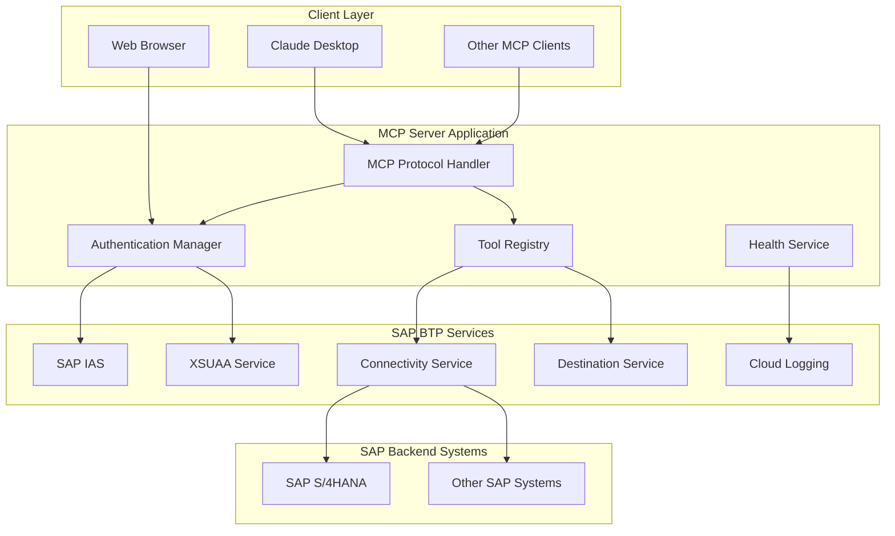
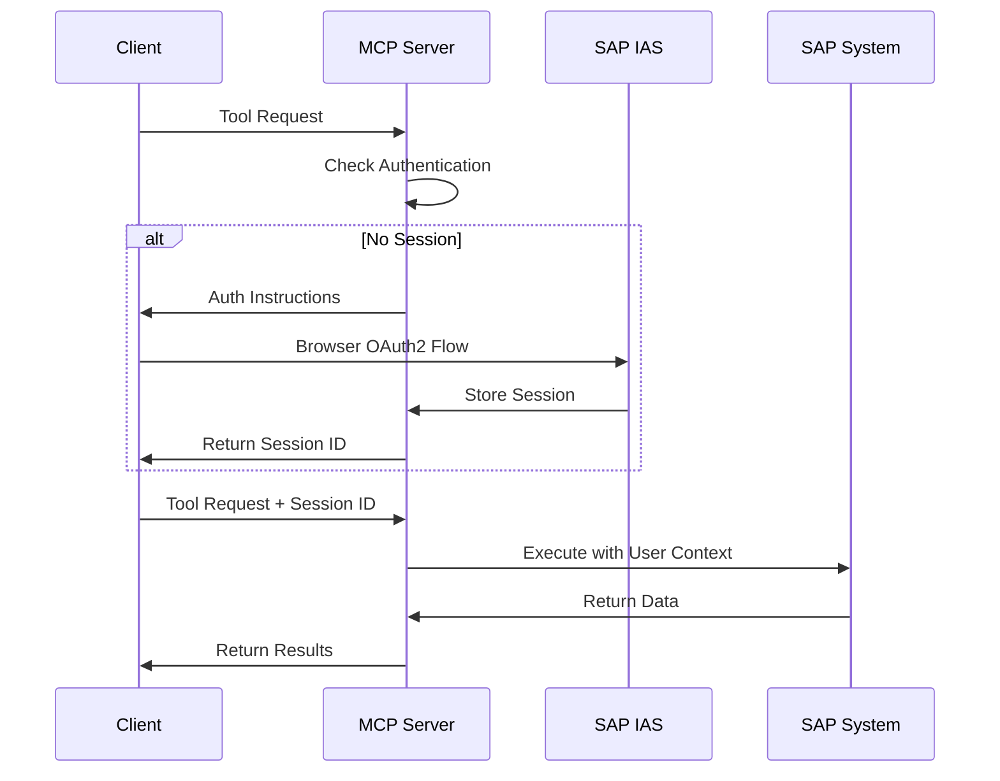
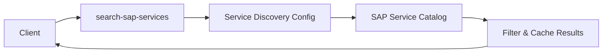
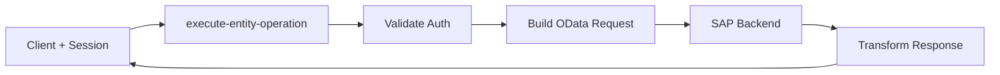
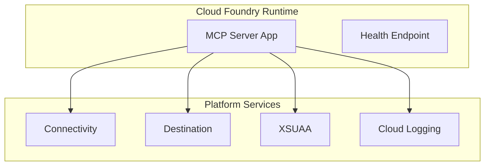

# System Architecture

> **Reference to Original Project**  
> This architecture extends the foundation laid by [@lemaiwo](https://github.com/lemaiwo)'s original [btp-sap-odata-to-mcp-server](https://github.com/lemaiwo/btp-sap-odata-to-mcp-server) with enterprise-grade enhancements.

## 🏗️ High-Level Architecture

## 🔧 Core Components

### 1. MCP Protocol Layer
- **Location**: `src/mcp-server.ts`, `src/tools/hierarchical-tool-registry.ts`
- **Purpose**: Handle MCP communication and tool management
- **Features**: HTTP/stdio transport, tool registration, request routing

### 2. Authentication & Authorization
- **Location**: `src/middleware/auth.ts`, `src/services/auth-server.ts`
- **Purpose**: Secure access control and session management
- **Features**: SAP IAS integration, JWT tokens, role-based permissions

### 3. Tool Registry
- **Location**: `src/tools/hierarchical-tool-registry.ts`
- **Purpose**: Manage and execute SAP OData tools
- **Categories**:
  - **Discovery Tools** (Public): `search-sap-services`, `discover-service-entities`
  - **Runtime Tools** (Authenticated): `execute-entity-operation`

### 4. SAP Connectivity Layer
- **Location**: `src/services/destination-service.ts`, `src/services/sap-client.ts`
- **Purpose**: Connect to SAP backend systems
- **Features**: Destination management, connection pooling, principal propagation

## 🔐 Security Architecture

### Authentication Flow

### Security Features
1. **Token Management**: JWT validation, session-based auth, auto-renewal
2. **Authorization**: Role-based access control, scope permissions
3. **Data Protection**: Request sanitization, audit logging, PII masking

## 📊 Data Flow

### Service Discovery Flow

### Entity Operation Flow

## 🚀 Deployment Architecture

### SAP BTP Cloud Foundry

**Deployment Features**:
- Auto-scaling based on load
- Service binding automation
- Health check integration
- Zero-downtime deployments

## 📈 Performance Optimizations

### Caching Strategy
- **Service Metadata**: 1 hour TTL
- **Schema Definitions**: 30 minutes TTL
- **Connection Pool**: Max 10 per destination

### Resource Management
- Async I/O processing
- Connection reuse
- Efficient session storage
- Automatic cleanup processes

---

**📖 Next Steps**: [Configuration Guide](CONFIGURATION.md) | [Deployment Guide](DEPLOYMENT.md)