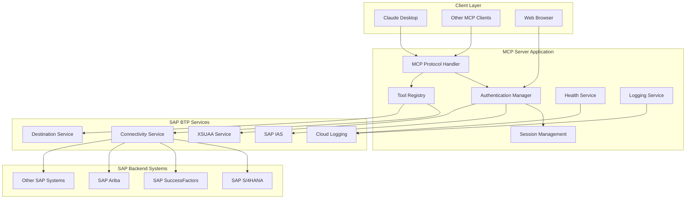
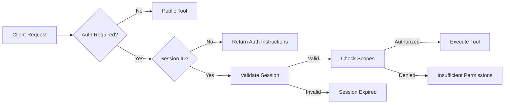
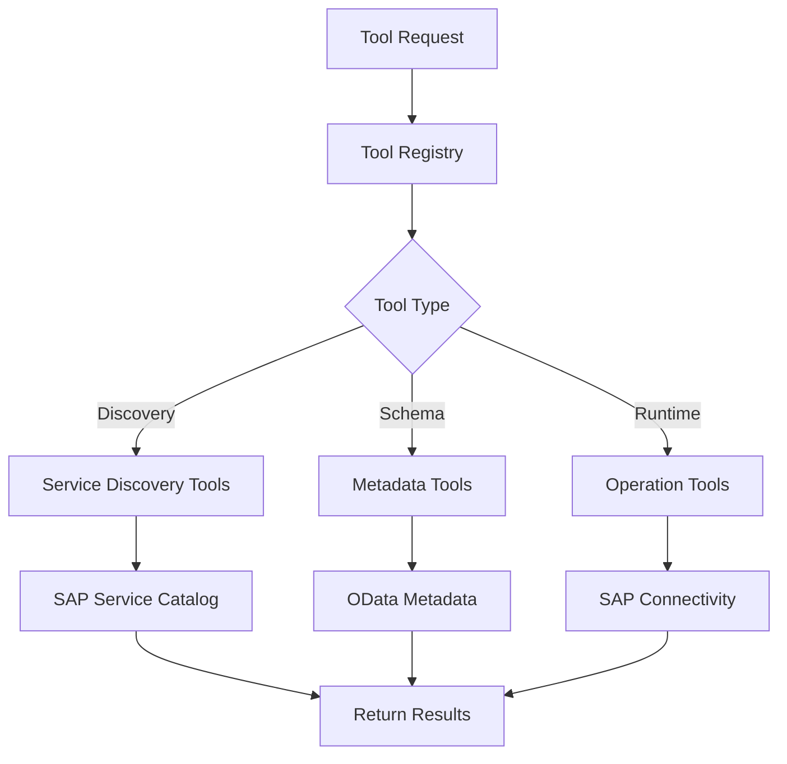
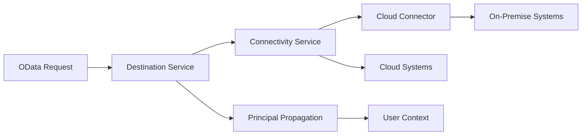
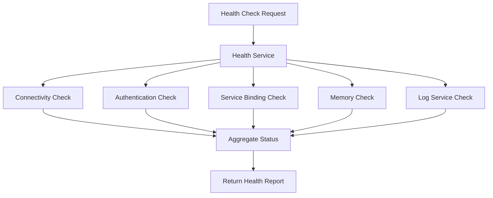
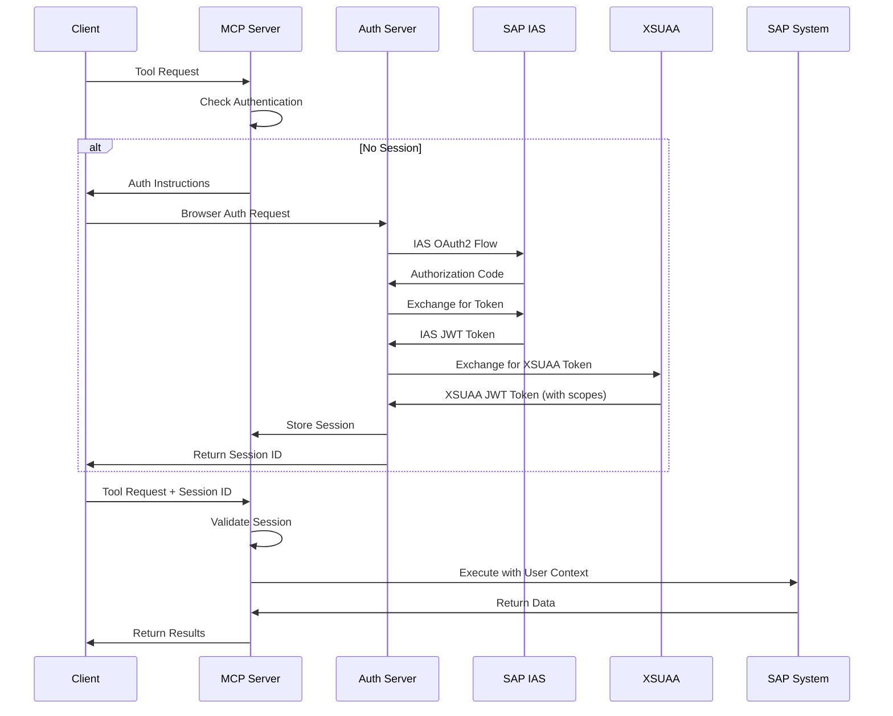
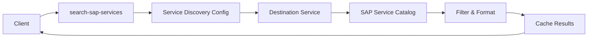
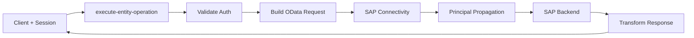
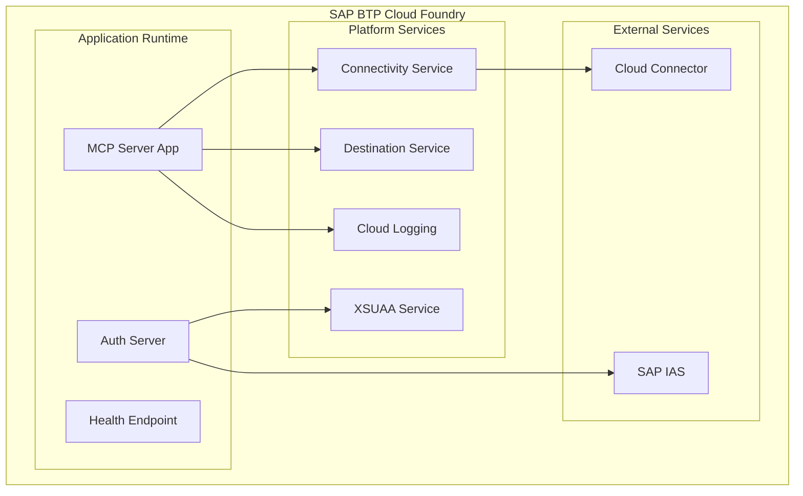
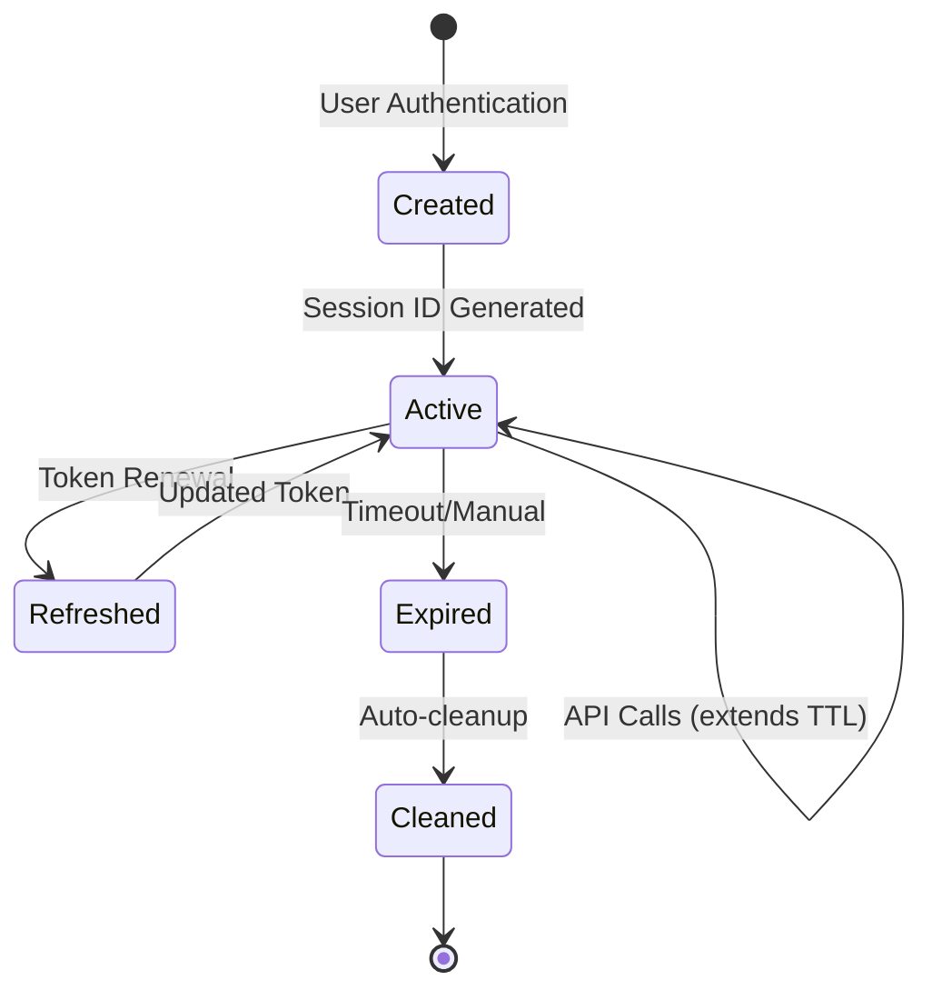

# System Architecture

> **Reference to Original Project**  
> This architecture extends the foundation laid by [@lemaiwo](https://github.com/lemaiwo)'s original [btp-sap-odata-to-mcp-server](https://github.com/lemaiwo/btp-sap-odata-to-mcp-server) with enterprise-grade enhancements.

## 🏗️ High-Level Architecture



## 🔧 Component Architecture

### 1. MCP Protocol Layer

**Location**: `src/mcp-server.ts`, `src/tools/hierarchical-tool-registry.ts`

**Responsibilities**:
- Handle MCP protocol communication
- Manage tool registration and execution
- Provide standardized error handling
- Route requests to appropriate handlers

**Key Features**:
- HTTP and stdio transport support
- Tool capability advertisement
- Request/response validation
- Protocol version management

```typescript
interface MCPServer {
  initialize(): Promise<void>
  connectStdio(): Promise<void>
  createHTTPTransport(options): StreamableHTTPServerTransport
}
```

### 2. Authentication & Authorization Layer

**Location**: `src/middleware/auth.ts`, `src/middleware/mcp-auth.ts`, `src/services/auth-server.ts`

**Architecture**:



**Components**:

#### IAS Authentication Service
- **File**: `src/services/ias-auth-service.ts`
- **Purpose**: Handle SAP Identity Authentication Service integration
- **Features**: OAuth2 flow, token exchange, user profile management

#### Session Management
- **File**: `src/services/token-store.ts`
- **Purpose**: Manage user sessions and JWT tokens
- **Features**: Session persistence, auto-cleanup, client tracking

#### Authorization Manager
- **File**: `src/middleware/mcp-auth.ts`
- **Purpose**: Handle request authorization and scope validation
- **Features**: Role-based access control, scope hierarchy, tool permissions

### 3. Tool Registry & Execution Engine

**Location**: `src/tools/hierarchical-tool-registry.ts`

**Architecture**:



**Tool Categories**:

1. **Discovery Tools** (Public)
   - `search-sap-services`
   - `discover-service-entities`
   - `get-entity-schema`

2. **Runtime Tools** (Authenticated)
   - `execute-entity-operation`

**Caching Strategy**:
- Service metadata caching
- Schema definition caching
- Connection pooling
- Result caching for read operations

### 4. SAP Connectivity Layer

**Location**: `src/services/destination-service.ts`, `src/services/sap-client.ts`

**Architecture**:



**Features**:
- Destination configuration management
- Principal propagation for user context
- Connection pooling and reuse
- Automatic retry with exponential backoff
- Certificate-based authentication

### 5. Monitoring & Observability Layer

**Location**: `src/services/health-service.ts`, `src/services/cloud-logging-service.ts`

#### Health Monitoring



**Health Check Components**:
- **Connectivity**: SAP system reachability
- **Authentication**: IAS/XSUAA service status  
- **Services**: Bound service availability
- **Resources**: Memory and disk usage
- **Logging**: Cloud logging service status

#### Structured Logging

```typescript
interface LogEntry {
  "@timestamp": string
  level: "ERROR" | "WARN" | "INFO" | "DEBUG"
  message: string
  service: string
  version: string
  component: string
  correlation_id: string
  cf_app: CFAppInfo
  context: LogContext
}
```

**Logging Features**:
- Correlation ID tracking across requests
- Structured JSON format for ELK stack
- Automatic Cloud Foundry metadata injection
- Performance metrics and timing
- Error tracking with stack traces

## 🔐 Security Architecture

### Authentication Flow



### Security Features

1. **Token Management**
   - JWT token validation and refresh
   - Session-based authentication
   - Automatic token renewal
   - Secure token storage

2. **Authorization**
   - Role-based access control (RBAC)
   - Scope-based permissions
   - Tool-level authorization
   - Operation-level authorization

3. **Data Protection**
   - Request/response sanitization
   - Secure error handling
   - PII data masking
   - Audit logging

## 📊 Data Flow Architecture

### Service Discovery Flow



### Entity Operation Flow



## 🚀 Deployment Architecture

### SAP BTP Cloud Foundry



**Deployment Features**:
- Zero-downtime deployments
- Auto-scaling based on load
- Service binding automation
- Environment-specific configuration
- Health check integration with platform

## 🔄 Session Management Architecture

### Session Lifecycle



**Session Features**:
- User-specific session isolation
- Configurable session timeout
- Automatic cleanup of expired sessions
- Session persistence across app restarts
- Client-specific session tracking

## 📈 Performance Optimizations

### Caching Strategy

1. **Service Metadata Cache**
   - TTL: 1 hour
   - Scope: Per service
   - Invalidation: Manual + TTL

2. **Schema Definition Cache**
   - TTL: 30 minutes
   - Scope: Per entity set
   - Invalidation: Version-based

3. **Connection Pool**
   - Max connections: 10 per destination
   - Idle timeout: 5 minutes
   - Connection reuse for same user/destination

### Resource Management

- **Memory**: Efficient object pooling
- **CPU**: Async processing for I/O operations
- **Network**: Connection reuse and HTTP/2 support
- **Storage**: Optimized session storage with cleanup

## 🔮 Future Architecture Enhancements

### Planned Improvements

1. **Microservices Architecture**
   - Split authentication service
   - Separate tool registry service
   - Independent scaling components

2. **Advanced Caching**
   - Redis-based distributed caching
   - Cache warming strategies
   - Intelligent cache invalidation

3. **Enhanced Monitoring**
   - Application Performance Monitoring (APM)
   - Distributed tracing
   - Custom metrics dashboards
   - Alerting and notification system

4. **Multi-tenancy Support**
   - Tenant-specific configurations
   - Isolated data access
   - Tenant-aware caching

---

**📖 Related Documentation**:
- [Configuration Guide](CONFIGURATION.md)
- [Deployment Guide](DEPLOYMENT.md)  
- [API Reference](API_REFERENCE.md)
- [Troubleshooting](TROUBLESHOOTING.md)