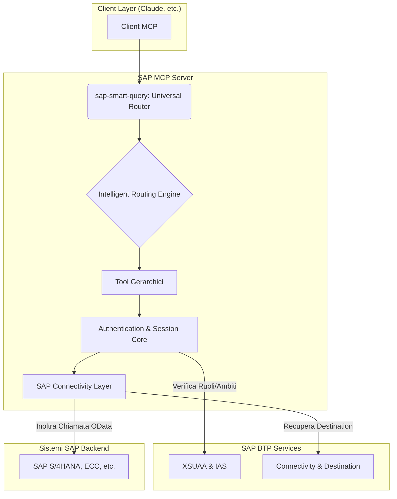

# Architettura di Sistema

Questa architettura estende le fondamenta del progetto originale con miglioramenti enterprise, focalizzandosi su un modello a tool gerarchico e un routing intelligente per massimizzare l'efficienza e la semplicità d'uso.

## Architettura Concettuale

## Componenti Chiave

### 1. Il Modello a Tool Gerarchici

Il problema della "tool explosion" (centinaia di tool per ogni entità e operazione) è risolto a livello architetturale. Invece di registrare un tool per ogni operazione CRUD, il sistema espone un **set limitato di tool di alto livello**:

-   **Tool di Discovery (Pubblici)**: `search-sap-services`, `discover-service-entities`, `get-entity-schema`.
-   **Tool di Esecuzione (Protetti)**: `execute-entity-operation`.
-   **Tool AI & Real-time**: `natural-query-builder`, `smart-data-analysis`, `realtime-data-stream`, etc.

Questo approccio **riduce drasticamente il contesto** inviato al client (da migliaia a poche centinaia di token), migliora le performance e semplifica l'interazione per l'utente finale.

### 2. Il Router Universale `sap-smart-query`

Questo è **l'unico entry point** che l'utente dovrebbe usare. Il router agisce come un "cervello" che:

1.  **Analizza la Richiesta**: Determina se la richiesta è in linguaggio naturale, una query OData diretta o un'intenzione specifica (es. "analizza performance").
2.  **Orchestra il Workflow**: Seleziona e orchestra la sequenza di tool gerarchici necessari per soddisfare la richiesta.
3.  **Semplifica l'Interazione**: L'utente non ha bisogno di conoscere quale tool specifico chiamare; il router lo fa per lui.

### 3. Livello di Autenticazione e Sessioni

-   **Location**: `src/middleware/auth.ts`, `src/services/auth-server.ts`
-   **Funzione**: Gestisce l'accesso sicuro tramite un flusso basato su sessioni che si integra con **SAP IAS** e **XSUAA**.
-   **Caratteristiche**: L'utente si autentica una sola volta per sessione. Il server mantiene il contesto di sicurezza per tutte le chiamate successive, utilizzando `PrincipalPropagation` dove configurato.

### 4. Livello di Connettività SAP

-   **Location**: `src/services/destination-service.ts`, `src/services/sap-client.ts`
-   **Funzione**: Abstrae la complessità della connessione ai sistemi SAP backend.
-   **Caratteristiche**: Utilizza i servizi **Connectivity** e **Destination** di BTP per recuperare le configurazioni di connessione in modo sicuro e gestire il `Principal Propagation`.

## Flusso dei Dati: Esempio di Query in Linguaggio Naturale

1.  **Utente**: Invia la richiesta "mostrami i clienti di Roma" al tool `sap-smart-query`.
2.  **Smart Router**: Analizza la richiesta e determina che è necessaria una query.
3.  **Natural Query Builder**: Il router invoca il tool `natural-query-builder`, che traduce la richiesta nella query OData `A_BusinessPartner?$filter=City eq 'Rome'`.
4.  **Authentication Check**: Il router invoca `execute-entity-operation` con la query. Il middleware di autenticazione verifica che l'utente abbia una sessione valida e i permessi necessari (es. scope `read`).
5.  **SAP Connectivity**: Il `SAPClient` recupera la destinazione dal servizio Destination di BTP e inoltra la richiesta OData al sistema SAP S/4HANA.
6.  **Risposta**: I dati vengono restituiti al client, potenzialmente dopo un'ulteriore analisi da parte del tool `smart-data-analysis`.

---

**Prossimi Passi**: [Guida alla Configurazione](./CONFIGURATION.md) | [Guida al Deployment](./DEPLOYMENT.md)
