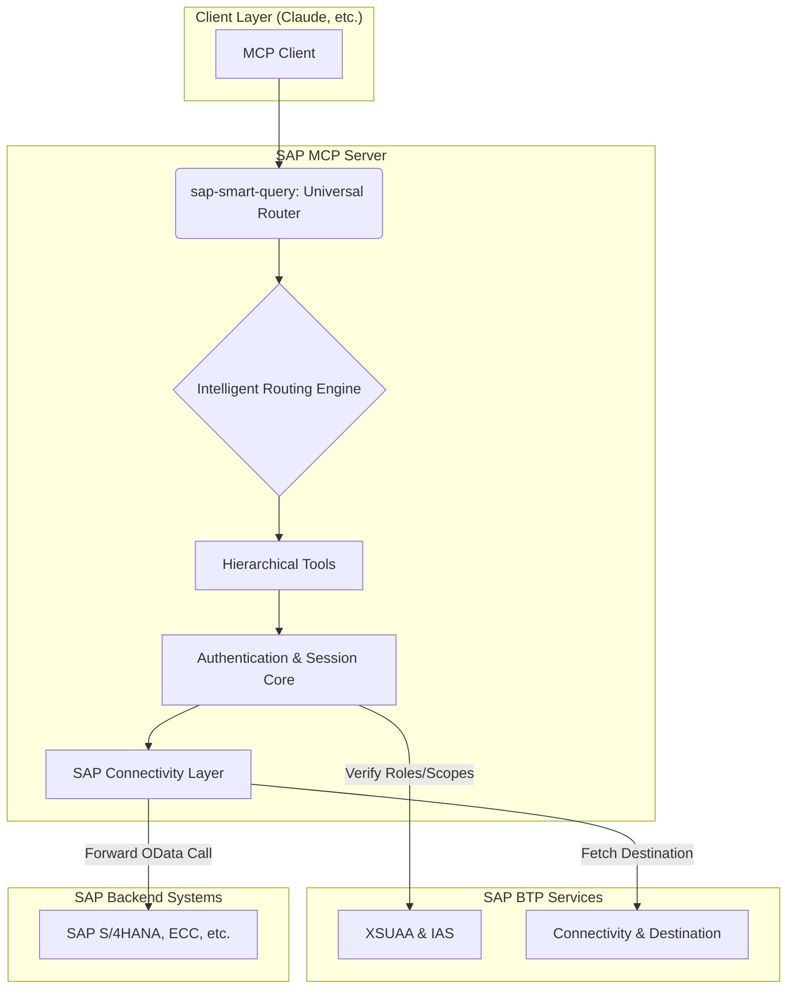

# System Architecture

This architecture extends the foundations of the original project with enterprise enhancements, focusing on a hierarchical tool model and intelligent routing to maximize efficiency and ease of use.

## Conceptual Architecture

## Key Components

### 1. The Hierarchical Tool Model

The "tool explosion" problem (hundreds of tools for each entity and operation) is solved at an architectural level. Instead of registering a tool for each CRUD operation, the system exposes a **limited set of high-level tools**:

-   **Discovery Tools (Public)**: `search-sap-services`, `discover-service-entities`, `get-entity-schema`.
-   **Execution Tools (Protected)**: `execute-entity-operation`.
-   **AI & Real-time Tools**: `natural-query-builder`, `smart-data-analysis`, `realtime-data-stream`, etc.

This approach **drastically reduces the context** sent to the client (from thousands to a few hundred tokens), improves performance, and simplifies the interaction for the end-user.

### 2. The `sap-smart-query` Universal Router

This is the **only entry point** the user should ever use. The router acts as a "brain" that:

1.  **Analyzes the Request**: Determines if the request is in natural language, a direct OData query, or a specific intent (e.g., "analyze performance").
2.  **Orchestrates the Workflow**: Selects and orchestrates the sequence of hierarchical tools needed to fulfill the request.
3.  **Simplifies Interaction**: The user does not need to know which specific tool to call; the router does it for them.

### 3. Authentication and Session Layer

-   **Location**: `src/middleware/auth.ts`, `src/services/auth-server.ts`
-   **Function**: Manages secure access through a session-based flow that integrates with **SAP IAS** and **XSUAA**.
-   **Features**: The user authenticates once per session. The server maintains the security context for all subsequent calls, using `PrincipalPropagation` where configured.

### 4. SAP Connectivity Layer

-   **Location**: `src/services/destination-service.ts`, `src/services/sap-client.ts`
-   **Function**: Abstracts the complexity of connecting to backend SAP systems.
-   **Features**: Uses the **Connectivity** and **Destination** services of BTP to securely retrieve connection configurations and manage `Principal Propagation`.

## Data Flow: Example of a Natural Language Query

1.  **User**: Sends the request "show me customers from Rome" to the `sap-smart-query` tool.
2.  **Smart Router**: Analyzes the request and determines that a query is needed.
3.  **Natural Query Builder**: The router invokes the `natural-query-builder` tool, which translates the request into the OData query `A_BusinessPartner?$filter=City eq 'Rome'`.
4.  **Authentication Check**: The router invokes `execute-entity-operation` with the query. The authentication middleware verifies that the user has a valid session and the necessary permissions (e.g., `read` scope).
5.  **SAP Connectivity**: The `SAPClient` retrieves the destination from the BTP Destination service and forwards the OData request to the SAP S/4HANA system.
6.  **Response**: The data is returned to the client, potentially after further analysis by the `smart-data-analysis` tool.

---

**Next Steps**: [Configuration Guide](./CONFIGURATION.md) | [Deployment Guide](./DEPLOYMENT.md)