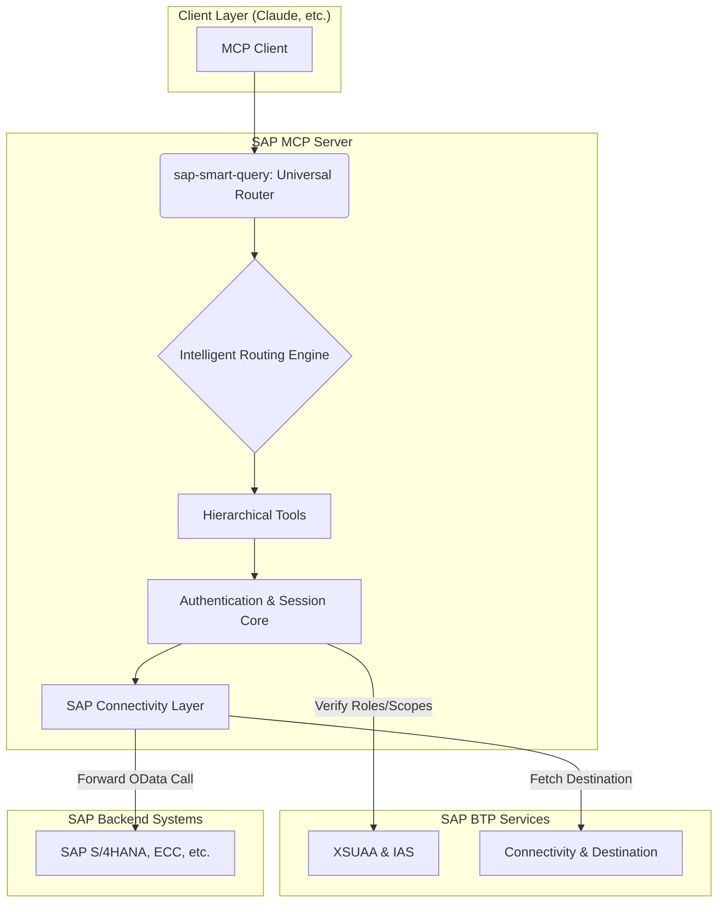
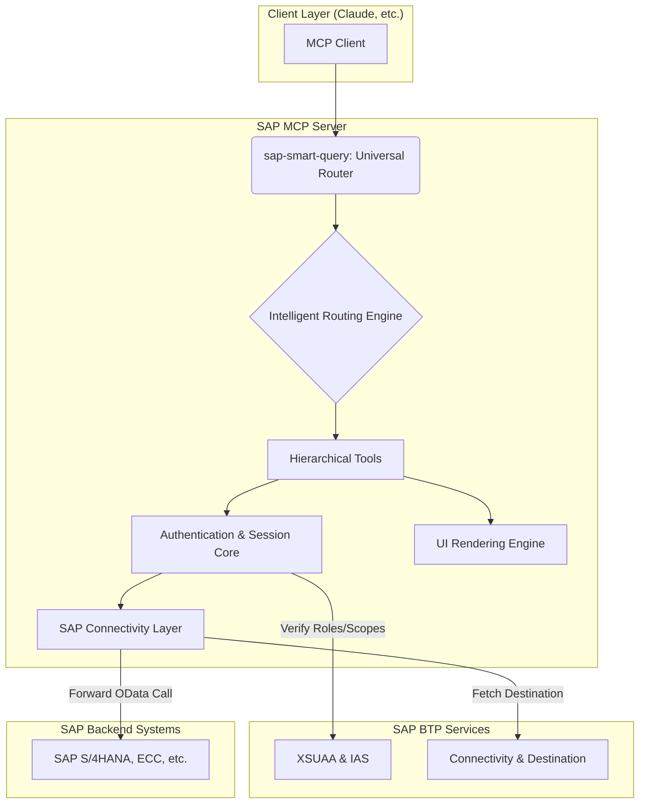

# System Architecture

This architecture extends the foundations of the original project with enterprise enhancements, focusing on a hierarchical tool model and intelligent routing to maximize efficiency and ease of use.

## Conceptual Architecture

## Key Components

### 1. The `sap-smart-query` Universal Router

This is the **primary entry point** for all user interactions. The router acts as a "brain" that analyzes the user's request and determines the most efficient path to a solution. It is powered by the **Intelligent Tool Router** middleware.

-   **Analyzes Intent**: It deciphers whether the request is in natural language (e.g., "show me top 5 sales orders"), a direct OData query, or a complex intent requiring multiple steps.
-   **Orchestrates Workflows**: It selects and chains together the necessary hierarchical tools to fulfill the request, making the underlying complexity invisible to the user.
-   **Simplifies Interaction**: The user does not need to know which specific tool to call; the router handles the entire workflow.

### 2. Intelligent Tool Router (`intelligent-tool-router.ts`)

This middleware is the engine that powers the `sap-smart-query` tool. It uses a rules-based system defined in `config/tool-routing-rules.json` to map user intents to specific tool execution chains. This approach is both efficient and easily extensible.

### 3. Hierarchical Tool Model

The "tool explosion" problem is solved by exposing a limited set of high-level, function-specific tools instead of a tool for every single API endpoint.

-   **Discovery Tools**: `search-sap-services`, `discover-service-entities`, `get-entity-schema`. These are public and used to explore available data.
-   **Execution Tools**: `execute-entity-operation`. This protected tool is the gateway for all data operations (CRUD).
-   **AI & Real-time Services**: A suite of services that provide advanced capabilities.

### 4. AI and Real-time Services

-   **AI Query Builder (`ai-query-builder.ts`)**: Translates natural language into precise OData queries. This is a core component of the natural language understanding capability.
-   **Real-time Analytics (`realtime-analytics.ts`)**: Provides services for real-time data streaming and KPI monitoring, opening possibilities for live dashboards and alerts.
-   **Cloud Logging Service (`cloud-logging-service.ts`)**: A robust logging service that provides structured, enterprise-grade logging for monitoring and auditing.

### 5. Authentication and Session Layer (`auth.ts`, `mcp-auth.ts`)

# System Architecture

This architecture extends the foundations of the original project with enterprise enhancements, focusing on a hierarchical tool model, intelligent routing, and a powerful UI generation layer to maximize efficiency and ease of use.

## Conceptual Architecture

## Key Components

### 1. The `sap-smart-query` Universal Router

This is the **primary entry point** for all user interactions. The router acts as a "brain" that analyzes the user's request and determines the most efficient path to a solution. It is powered by the **Intelligent Tool Router** middleware.

-   **Analyzes Intent**: It deciphers whether the request is in natural language (e.g., "show me top 5 sales orders"), a direct OData query, a request for a UI ("create a form for customers"), or a complex intent requiring multiple steps.
-   **Orchestrates Workflows**: It selects and chains together the necessary hierarchical tools to fulfill the request, making the underlying complexity invisible to the user.
-   **Simplifies Interaction**: The user does not need to know which specific tool to call; the router handles the entire workflow.

### 2. Intelligent Tool Router (`intelligent-tool-router.ts`)

This middleware is the engine that powers the `sap-smart-query` tool. It uses a rules-based system defined in `config/tool-routing-rules.json` to map user intents to specific tool execution chains. This approach is both efficient and easily extensible, and it includes patterns for detecting UI-related requests.

### 3. Hierarchical Tool Model

The "tool explosion" problem is solved by exposing a limited set of high-level, function-specific tools instead of a tool for every single API endpoint. The tools are organized into clear categories:

-   **Discovery Tools**: `search-sap-services`, `discover-service-entities`, `get-entity-schema`. These are public and used to explore available data.
-   **Execution Tools**: `execute-entity-operation`. This protected tool is the gateway for all data operations (CRUD).
-   **UI Tools**: `ui-form-generator`, `ui-data-grid`, `ui-dashboard-composer`, `ui-workflow-builder`, `ui-report-builder`. A suite of tools that generate interactive user interfaces based on SAP data and metadata.
-   **AI & Real-time Services**: A suite of services that provide advanced capabilities like natural language processing, data analysis, and real-time streaming.

### 4. UI Rendering Engine and Tools

This is a new layer responsible for generating interactive HTML and JavaScript frontends based on SAP Fiori design principles.

-   **UI Tools Suite**: A set of 5 tools that abstract the complexity of UI generation. For example, `ui-form-generator` takes an entity schema and produces a fully functional HTML form for creating or updating that entity.
-   **UI Rendering Engine (`ui-rendering-engine.ts`)**: A core component that uses a template engine (like Handlebars or EJS) combined with a library of pre-defined SAP Fiori components to render the final HTML. It ensures consistency in style and behavior across all generated UIs.
-   **Automatic Suggestion**: The `sap-smart-query` router is designed to automatically suggest the use of a UI tool when appropriate. For example, after fetching a list of entities, it will suggest using `ui-data-grid` to visualize them.

### 5. AI and Real-time Services

-   **AI Query Builder (`ai-query-builder.ts`)**: Translates natural language into precise OData queries. This is a core component of the natural language understanding capability.
-   **Real-time Analytics (`realtime-analytics.ts`)**: Provides services for real-time data streaming and KPI monitoring, opening possibilities for live dashboards and alerts.
-   **Cloud Logging Service (`cloud-logging-service.ts`)**: A robust logging service that provides structured, enterprise-grade logging for monitoring and auditing.

### 6. Authentication and Session Layer (`auth.ts`, `mcp-auth.ts`)

Manges secure access through a session-based flow that integrates with **SAP IAS** and **XSUAA**. The user authenticates once, and the server maintains the security context for all subsequent calls, using `PrincipalPropagation` where configured. This layer also enforces role-based access to the UI tools.

### 7. SAP Connectivity Layer (`sap-client.ts`, `destination-service.ts`)

Abstracts the complexity of connecting to backend SAP systems. It uses the **Connectivity** and **Destination** services of BTP to securely retrieve connection details and manage tokens.

## Data Flow: Example of a UI Generation Request

1.  **User**: Sends the request "create a form to add a new business partner" to the `sap-smart-query` tool.
2.  **Smart Router & Intelligent Tool Router**: The router analyzes the request. The routing engine recognizes the intent to create a UI ("form") for a specific entity ("business partner").
3.  **Tool Orchestration**: The router determines the required sequence:
    a. `get-entity-schema` to fetch the structure of the `A_BusinessPartner` entity.
    b. `ui-form-generator` to process the schema and generate the UI.
4.  **Authentication**: The `auth` middleware verifies the user's session and checks if they have the necessary scope (e.g., `ui.forms`) to use the UI tool.
5.  **UI Generation**:
    a. The `ui-form-generator` tool receives the entity schema.
    b. It invokes the **UI Rendering Engine**, which uses its templates and component library to build the HTML.
    c. The generated HTML includes SAP Fiori styling, client-side validation logic, and the necessary JavaScript to handle form submission.
6.  **Response**: The complete, interactive HTML form is returned to the client, ready to be displayed to the user.

---

**Next Steps**: [Configuration Guide](./CONFIGURATION.md) | [Deployment Guide](./DEPLOYMENT.md)

### 6. SAP Connectivity Layer (`sap-client.ts`, `destination-service.ts`)

Abstracts the complexity of connecting to backend SAP systems. It uses the **Connectivity** and **Destination** services of BTP to securely retrieve connection details and manage tokens.

## Data Flow: Example of a Natural Language Query

1.  **User**: Sends the request "show me customers from Rome" to the `sap-smart-query` tool.
2.  **Smart Router & Intelligent Tool Router**: The router analyzes the request. The routing engine determines that this is a natural language query that needs to be translated.
3.  **AI Query Builder**: The router invokes the `ai-query-builder` service, which translates the request into the OData query: `A_BusinessPartner?$filter=City eq 'Rome'`.
4.  **Authentication & Execution**: The router passes this query to the `execute-entity-operation` tool. The `auth` middleware automatically verifies the user's session and permissions.
5.  **SAP Connectivity**: The `SAPClient` retrieves the destination details and forwards the authenticated OData request to the SAP S/4HANA backend.
6.  **Response**: The data is returned to the client. The router might perform additional steps, like invoking an analysis tool if the user had asked for "an analysis of customers in Rome".

---

**Next Steps**: [Configuration Guide](./CONFIGURATION.md) | [Deployment Guide](./DEPLOYMENT.md)