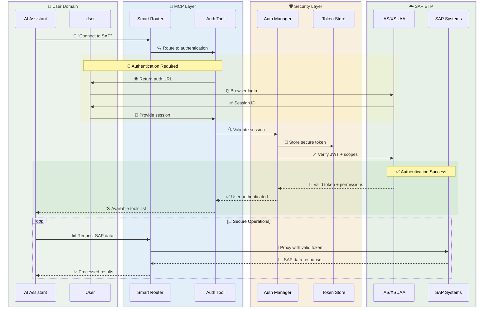
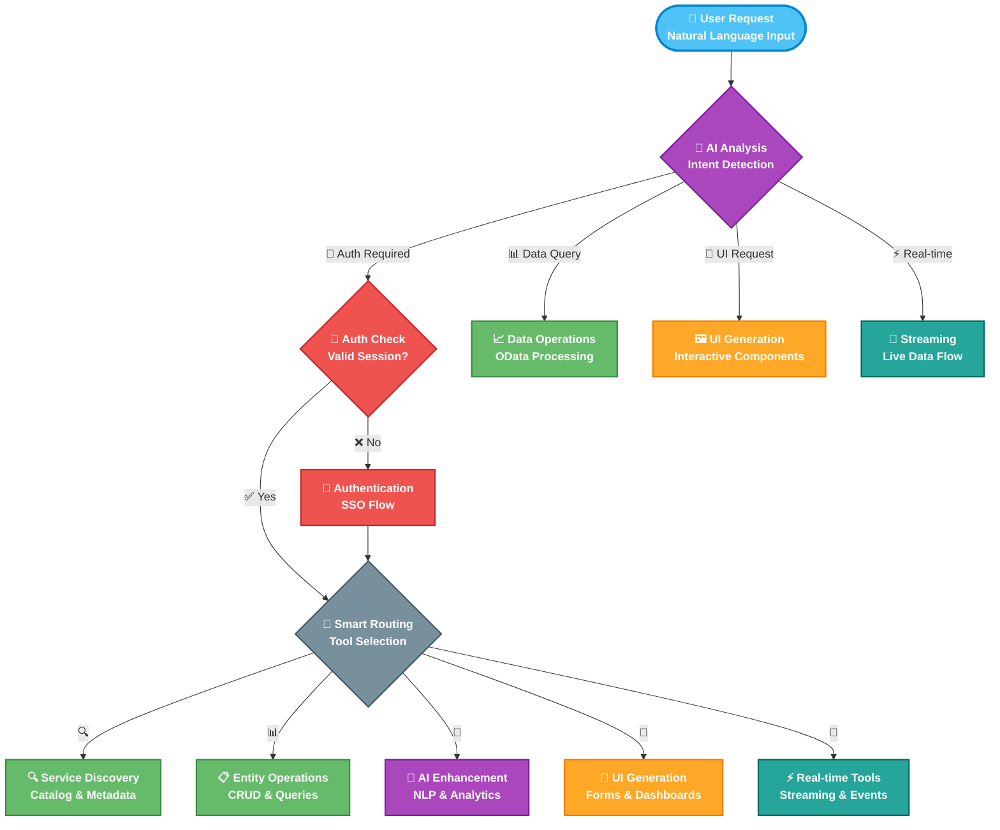
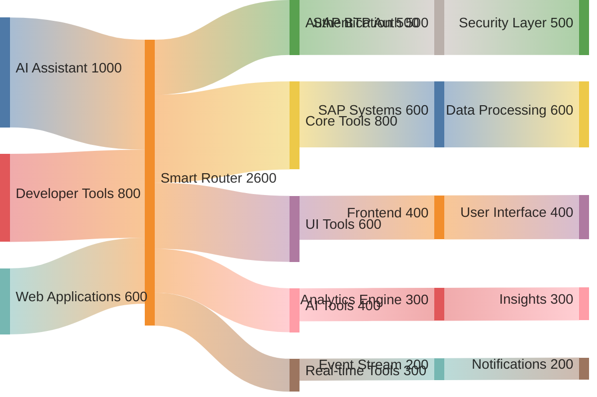
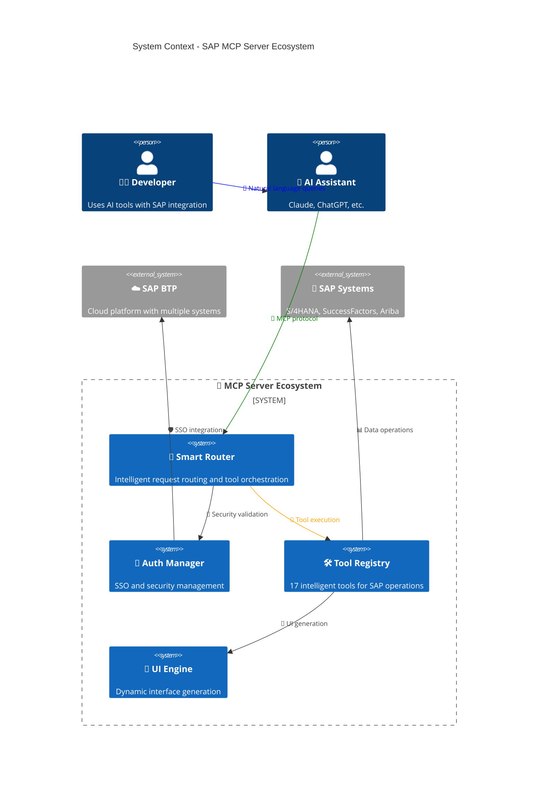
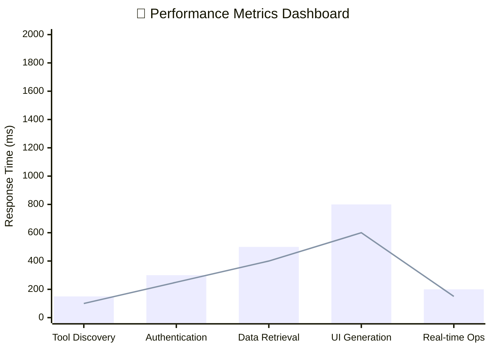
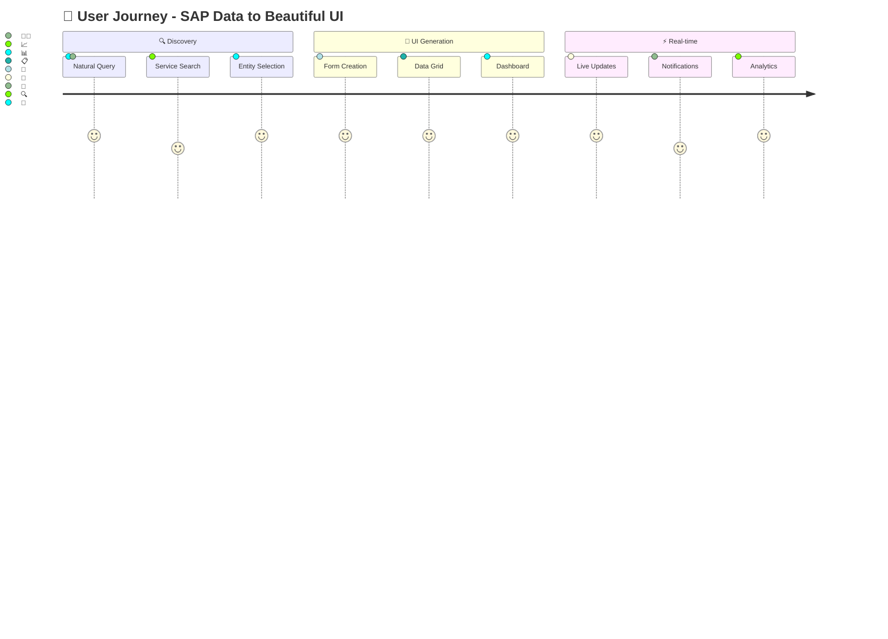
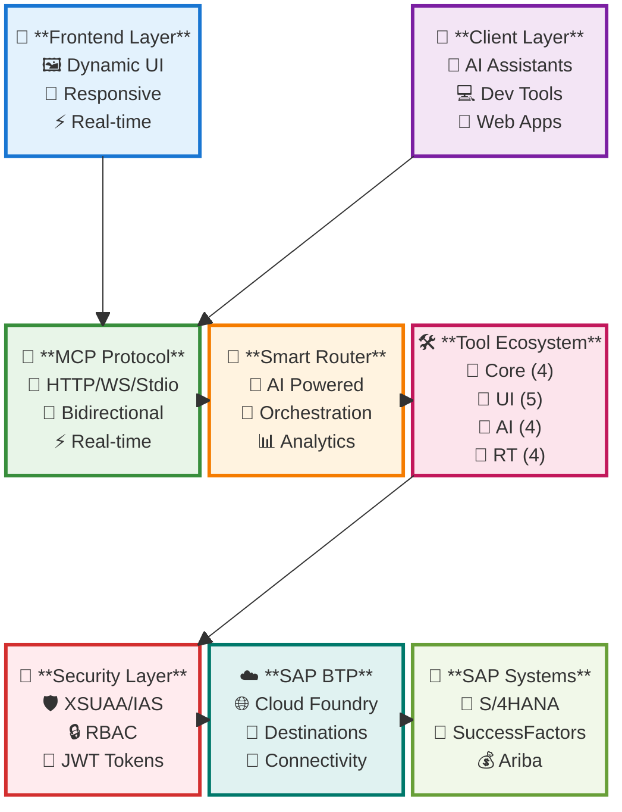

# 🎨 Modern Architecture Diagrams

> **Enterprise SAP OData to MCP Server - Visual Architecture Guide**

  

---

## 🏗️ **System Architecture Overview**

```mermaid
graph TB
    subgraph "🌐 Client Layer"
        A["`🤖 **AI Assistant**
        Claude, ChatGPT, etc.`"]
        B["`💻 **Developer Tools**
        VS Code, Cursor`"]
        C["`📱 **Web Apps**
        Custom Integrations`"]
    end

    subgraph "🔌 MCP Protocol Layer"
        D["`⚡ **MCP Transport**
        HTTP/WebSocket/Stdio`"]
    end

    subgraph "🧠 Smart Router Core"
        E["`🎯 **sap-smart-query**
        Universal Entry Point`"]
        F["`🤖 **AI Router**
        Natural Language Processing`"]
        G["`🔀 **Tool Orchestrator**
        Intelligent Chaining`"]
    end

    subgraph "🛠️ Tool Ecosystem"
        subgraph "🔐 Core Tools"
            H1["`🔑 **Authentication**
            SSO & Security`"]
            H2["`🔍 **Discovery**
            Service Catalog`"]
            H3["`📊 **Data Access**
            OData Operations`"]
            H4["`⚙️ **Configuration**
            System Setup`"]
        end

        subgraph "🎨 UI Tools"
            I1["`📝 **Form Generator**
            Dynamic Forms`"]
            I2["`📋 **Data Grid**
            Interactive Tables`"]
            I3["`📊 **Dashboard**
            KPI Composer`"]
            I4["`🔄 **Workflow**
            Process Builder`"]
            I5["`📈 **Reports**
            Analytics Builder`"]
        end

        subgraph "🧠 AI Tools"
            J1["`💬 **Query Builder**
            Natural Language`"]
            J2["`📈 **Data Analytics**
            Smart Insights`"]
            J3["`🔍 **Entity Manager**
            Semantic Search`"]
            J4["`⚡ **Performance**
            Query Optimization`"]
        end

        subgraph "📡 Real-time Tools"
            K1["`🔄 **Data Streaming**
            Live Updates`"]
            K2["`📊 **KPI Monitor**
            Real-time Metrics`"]
            K3["`⏰ **Scheduler**
            Automated Tasks`"]
            K4["`📧 **Notifications**
            Event Alerts`"]
        end
    end

    subgraph "🔐 Security Layer"
        L["`🛡️ **Authentication Manager**
        IAS/XSUAA Integration`"]
        M["`🔒 **Authorization Engine**
        RBAC & Scopes`"]
        N["`🔐 **Token Store**
        Secure Session Management`"]
    end

    subgraph "☁️ SAP BTP Cloud Foundry"
        subgraph "🎯 Destinations"
            O1["`💼 **SAP S/4HANA**
            ERP System`"]
            O2["`🏭 **SAP SuccessFactors**
            HCM System`"]
            O3["`💰 **SAP Ariba**
            Procurement`"]
            O4["`📊 **SAP Analytics Cloud**
            BI Platform`"]
        end

        subgraph "🔧 BTP Services"
            P1["`🔑 **XSUAA**
            Auth Service`"]
            P2["`🌐 **Connectivity**
            Proxy Service`"]
            P3["`📍 **Destination**
            Config Service`"]
            P4["`📊 **Logging**
            Monitor Service`"]
        end
    end

    %% Connections with modern styling
    A --> D
    B --> D
    C --> D
    D --> E
    E --> F
    E --> G
    F --> G

    %% Smart routing
    G -.-> H1
    G -.-> H2
    G -.-> H3
    G -.-> H4
    G -.-> I1
    G -.-> I2
    G -.-> I3
    G -.-> I4
    G -.-> I5
    G -.-> J1
    G -.-> J2
    G -.-> J3
    G -.-> J4
    G -.-> K1
    G -.-> K2
    G -.-> K3
    G -.-> K4

    %% Security integration
    H1 --> L
    L --> M
    M --> N
    L --> P1

    %% SAP connectivity
    H2 --> P2
    H3 --> P3
    H3 --> O1
    H3 --> O2
    H3 --> O3
    H3 --> O4

    %% Styling
    classDef clientStyle fill:#e1f5fe,stroke:#01579b,stroke-width:2px,color:#000
    classDef mcpStyle fill:#f3e5f5,stroke:#4a148c,stroke-width:2px,color:#000
    classDef coreStyle fill:#e8f5e8,stroke:#1b5e20,stroke-width:2px,color:#000
    classDef toolStyle fill:#fff3e0,stroke:#e65100,stroke-width:2px,color:#000
    classDef securityStyle fill:#ffebee,stroke:#b71c1c,stroke-width:2px,color:#000
    classDef sapStyle fill:#e3f2fd,stroke:#0d47a1,stroke-width:2px,color:#000

    class A,B,C clientStyle
    class D mcpStyle
    class E,F,G coreStyle
    class H1,H2,H3,H4,I1,I2,I3,I4,I5,J1,J2,J3,J4,K1,K2,K3,K4 toolStyle
    class L,M,N securityStyle
    class O1,O2,O3,O4,P1,P2,P3,P4 sapStyle
```



---

## 🔄 **Authentication Flow - Modern Design**



---

## 🎯 **Smart Query Router - AI-Powered Decision Tree**



---

## 🏛️ **Tool Hierarchy - Modern Architecture**

```mermaid
mindmap
  root)🎯 **SAP MCP Server**
    (🔐 **Core Layer**)
      [🔑 Authentication]
        ::icon(fas fa-key)
      [🔍 Service Discovery]
        ::icon(fas fa-search)
      [📊 Data Operations]
        ::icon(fas fa-database)
      [⚙️ Configuration]
        ::icon(fas fa-cog)

    (🎨 **UI Layer**)
      [📝 Form Generator]
        ::icon(fas fa-edit)
      [📋 Data Grid]
        ::icon(fas fa-table)
      [📊 Dashboard Composer]
        ::icon(fas fa-chart-line)
      [🔄 Workflow Builder]
        ::icon(fas fa-project-diagram)
      [📈 Report Builder]
        ::icon(fas fa-chart-bar)

    (🧠 **AI Layer**)
      [💬 Natural Query]
        ::icon(fas fa-comments)
      [📈 Smart Analytics]
        ::icon(fas fa-brain)
      [🔍 Entity Manager]
        ::icon(fas fa-sitemap)
      [⚡ Performance]
        ::icon(fas fa-tachometer-alt)

    (📡 **Real-time Layer**)
      [🔄 Data Streaming]
        ::icon(fas fa-stream)
      [📊 KPI Monitor]
        ::icon(fas fa-chart-pie)
      [⏰ Scheduler]
        ::icon(fas fa-clock)
      [📧 Notifications]
        ::icon(fas fa-bell)
```

---

## 🌊 **Data Flow Architecture**



---

## 🎭 **Component Interaction - 3D Perspective**



---

## 📊 **Performance & Scalability Metrics**



---

## 🎨 **Modern UI Components Showcase**



---

## 🏗️ **Technology Stack Visualization**



---

## ✨ **Design System & Color Palette**

### 🎨 **Modern Color Scheme**

- **Primary**: `#1976D2` (Material Blue)
- **Secondary**: `#F57C00` (Material Orange)
- **Success**: `#388E3C` (Material Green)
- **Warning**: `#FBC02D` (Material Yellow)
- **Error**: `#D32F2F` (Material Red)
- **Info**: `#0288D1` (Light Blue)

### 🎯 **Component Guidelines**

- **Rounded Corners**: 8px border-radius
- **Shadows**: Material Design elevation
- **Typography**: Inter/Roboto font family
- **Icons**: Material Design Icons
- **Animations**: Smooth 300ms transitions

---

*🎨 **Visualizzazione moderna e professionale dell'architettura SAP MCP Server***

*Progettato per sviluppatori, architetti e stakeholder tecnici*