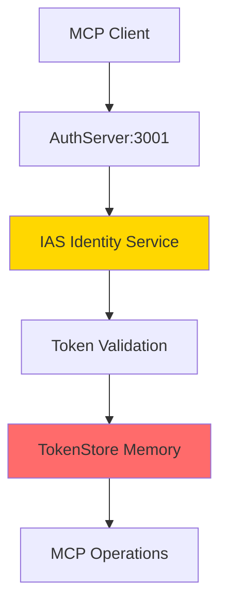
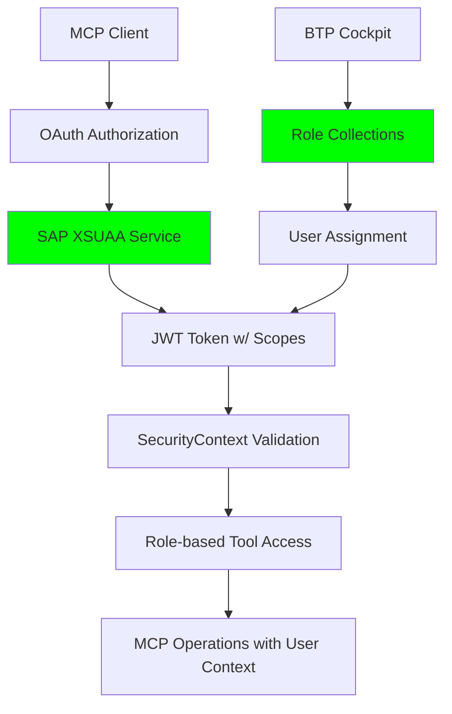

# 🔐 Identity Management Review & Action Plan
**SAP BTP MCP Server - Enhanced Authentication & Authorization**

---

## 📊 **EXECUTIVE SUMMARY**

### Current State Analysis
- **Authentication**: Custom IAS implementation with limited integration
- **Authorization**: Basic token validation without granular permissions
- **User Management**: Manual configuration with no enterprise scalability
- **Compliance**: Minimal audit trail and access control

### Target State Vision
- **Authentication**: Enterprise-grade XSUAA SAP BTP integration
- **Authorization**: Role-based access control with granular tool permissions
- **User Management**: BTP Cockpit-driven role collections and assignments
- **Compliance**: Full audit trail with principle of least privilege

---

## 🔍 **DETAILED ANALYSIS**

### **1. CURRENT AUTHENTICATION IMPLEMENTATION**

#### **Architecture Overview**


#### **Current Components**
| Component | File | Status | Issues |
|-----------|------|--------|--------|
| **IASAuthService** | `src/services/ias-auth-service.ts` | ✅ Functional | ❌ Not SAP BTP native |
| **AuthServer** | `src/services/auth-server.ts` | ✅ Functional | ❌ Separate port requirement |
| **TokenStore** | `src/services/token-store.ts` | ⚠️ In-memory only | ❌ Lost on restart |
| **MCPAuthManager** | `src/middleware/mcp-auth.ts` | ✅ Functional | ❌ No granular permissions |

#### **Current Limitations**
- ❌ **No XSUAA Integration**: Missing native SAP BTP authentication
- ❌ **Memory-based Tokens**: Lost on server restart
- ❌ **Separate Auth Server**: Additional port and complexity
- ❌ **No Role Management**: All authenticated users have same permissions
- ❌ **Limited Audit Trail**: Basic logging without user identity context

### **2. TARGET XSUAA AUTHENTICATION**

#### **Enhanced Architecture**


#### **XSUAA Integration Benefits**
| Aspect | Current (IAS) | Target (XSUAA) |
|--------|---------------|----------------|
| **BTP Integration** | ⚠️ External service | ✅ Native BTP service |
| **Token Management** | ❌ Manual handling | ✅ Automatic with refresh |
| **User Context** | ❌ Basic user info | ✅ Full SecurityContext |
| **Role Management** | ❌ None | ✅ BTP Cockpit managed |
| **Scope Validation** | ❌ None | ✅ Automatic per request |
| **Audit Trail** | ⚠️ Basic | ✅ Full user identity logging |

---

## 🎯 **AUTHORIZATION MODEL DESIGN**

### **3. GRANULAR PERMISSION MATRIX**

#### **Scope Definition**
```json
{
  "scopes": [
    {
      "name": "$XSAPPNAME.discovery",
      "description": "Service and metadata discovery operations"
    },
    {
      "name": "$XSAPPNAME.read",
      "description": "Read access to SAP OData services"
    },
    {
      "name": "$XSAPPNAME.write",
      "description": "Write access (Create/Update/Delete) to SAP OData services"
    },
    {
      "name": "$XSAPPNAME.analytics",
      "description": "Advanced analytics and business intelligence operations"
    },
    {
      "name": "$XSAPPNAME.realtime",
      "description": "Real-time data streaming and live analytics"
    },
    {
      "name": "$XSAPPNAME.admin",
      "description": "Administrative access to MCP server configuration"
    }
  ]
}
```

#### **Tool-to-Scope Mapping**
| **Tool Category** | **Tools** | **Required Scopes** | **Use Case** |
|-------------------|-----------|---------------------|--------------|
| **🔍 Discovery** | `search-sap-services`<br>`discover-service-entities`<br>`get-entity-schema` | `discovery` | Service exploration |
| **📖 Read Operations** | `natural-query-builder`<br>`sap-smart-query` (read)<br>`execute-entity-operation` (read) | `discovery`, `read` | Data consultation |
| **✏️ Write Operations** | `execute-entity-operation` (CUD)<br>`sap-smart-query` (write) | `discovery`, `read`, `write` | Data modification |
| **📊 Analytics** | `smart-data-analysis`<br>`business-process-insights`<br>`query-performance-optimizer` | `discovery`, `read`, `analytics` | Business intelligence |
| **🚀 Real-time** | `realtime-data-stream`<br>`predictive-analytics-engine`<br>`business-intelligence-insights` | `discovery`, `read`, `realtime` | Live monitoring |
| **📋 Dashboards** | `kpi-dashboard-builder` | `discovery`, `read`, `write`, `analytics` | Dashboard creation |
| **🔐 Administration** | `check-sap-authentication` | `admin` | System management |

#### **Role Template Hierarchy**
```yaml
Role Templates:
├─ MCPDiscoverer (Basic)
│   ├─ Scopes: discovery
│   └─ Use Case: Service catalog browsing only
│
├─ MCPViewer (Standard)
│   ├─ Scopes: discovery, read
│   └─ Use Case: Data consultation and reporting
│
├─ MCPAnalyst (Advanced)
│   ├─ Scopes: discovery, read, analytics, realtime
│   └─ Use Case: Business intelligence and monitoring
│
├─ MCPEditor (Power User)
│   ├─ Scopes: discovery, read, write, analytics
│   └─ Use Case: Data modification and analysis
│
└─ MCPAdmin (Administrator)
    ├─ Scopes: discovery, read, write, analytics, realtime, admin
    └─ Use Case: Full system administration
```

### **4. BTP COCKPIT ROLE COLLECTIONS**

#### **Recommended Role Collections**
| **Collection Name** | **Role Templates** | **Target Users** | **Business Justification** |
|---------------------|-------------------|------------------|---------------------------|
| **"Claude AI Basic Users"** | MCPDiscoverer, MCPViewer | General business users using Claude | Safe exploration without data modification |
| **"SAP Data Analysts"** | MCPViewer, MCPAnalyst | BI analysts and data scientists | Advanced analytics without write access |
| **"SAP Power Users"** | MCPViewer, MCPEditor | Functional experts and key users | Full operational access for daily work |
| **"MCP System Administrators"** | MCPAdmin | IT administrators and architects | System configuration and maintenance |

---

## 🚀 **COMPREHENSIVE ACTION PLAN**

### **PHASE 1: FOUNDATION SETUP (Week 1-2)**

#### **1.1 Environment Preparation**
- [ ] **Update Dependencies**
  ```bash
  npm install @sap/xssec@^3.6.1
  # @sap/xsenv already present in package.json
  ```

- [ ] **Create XSUAA Configuration**
  ```json
  // File: xs-security.json
  {
    "xsappname": "btp-sap-odata-to-mcp-server-optimized",
    "tenant-mode": "dedicated",
    "description": "Enhanced MCP Server Security Configuration",
    "scopes": [...], // As defined above
    "role-templates": [...], // As defined above
    "authorities": ["$XSAPPNAME.discovery"],
    "oauth2-configuration": {
      "redirect-uris": [
        "https://*.cfapps.*.hana.ondemand.com/**",
        "https://claude.ai/api/mcp/auth_callback",
        "http://localhost:3000/oauth/callback",
        "http://localhost:6274/**"
      ],
      "token-validity": 3600,
      "refresh-token-validity": 86400
    }
  }
  ```

- [ ] **Update MTA Configuration**
  ```yaml
  # File: mta.yaml - Add XSUAA resource
  resources:
    - name: sap-mcp-xsuaa
      type: org.cloudfoundry.managed-service
      parameters:
        service-name: sap-mcp-xsuaa-${space}
        service: xsuaa
        service-plan: application
        path: ./xs-security.json
        config:
          xsappname: btp-sap-odata-to-mcp-server-optimized-${space}
  ```

#### **1.2 Core Authentication Service**
- [ ] **Create XSUAAAuthService**
  ```typescript
  // File: src/services/xsuaa-auth-service.ts
  export class XSUAAAuthService {
    private xsuaaCredentials: Record<string, unknown> | null;

    constructor(logger?: Logger, config?: Config) {
      this.initializeXSUAA();
    }

    // OAuth flow methods
    getAuthorizationUrl(state?: string, requestUrl?: string): string
    exchangeCodeForToken(code: string, redirectUri?: string): Promise<TokenResponse>
    refreshAccessToken(refreshToken: string): Promise<TokenResponse>
    validateToken(token: string): Promise<xssec.SecurityContext>

    // Middleware methods
    authenticateJWT(): RequestHandler
    optionalAuthenticateJWT(): RequestHandler

    // Utility methods
    hasScope(securityContext: SecurityContext, scope: string): boolean
    getUserInfo(securityContext: SecurityContext): UserInfo
    isConfigured(): boolean
  }
  ```

### **PHASE 2: AUTHORIZATION IMPLEMENTATION (Week 2-3)**

#### **2.1 Tool Authorization Service**
- [ ] **Create ToolAuthorizationService**
  ```typescript
  // File: src/services/tool-authorization-service.ts
  export class ToolAuthorizationService {
    private toolScopeMap: Map<string, string[]>;

    checkToolAccess(
      toolName: string,
      securityContext: xssec.SecurityContext,
      operation?: string
    ): AuthorizationResult

    getRequiredScopes(toolName: string, operation?: string): string[]
    calculateEffectivePermissions(userScopes: string[]): PermissionSet
    generatePermissionReport(securityContext: SecurityContext): PermissionReport
  }

  interface AuthorizationResult {
    authorized: boolean;
    missingScope?: string;
    userScopes: string[];
    requiredScopes: string[];
    effectivePermissions?: PermissionSet;
  }
  ```

#### **2.2 Enhanced Tool Registry Integration**
- [ ] **Update HierarchicalToolRegistry**
  ```typescript
  // In src/tools/hierarchical-tool-registry.ts
  private async checkToolAuthorization(
    toolName: string,
    args: Record<string, unknown>
  ): Promise<void> {
    // Skip if XSUAA not configured (dev mode)
    if (!this.xsuaaAuthService?.isConfigured()) return;

    // Authenticate user
    const authResult = await this.authenticateUser(args);
    if (!authResult.authenticated) {
      throw new AuthenticationError(toolName);
    }

    // Authorize tool access
    const authzResult = this.toolAuthService.checkToolAccess(
      toolName,
      authResult.securityContext,
      args.operation as string
    );

    if (!authzResult.authorized) {
      throw new AuthorizationError(toolName, authzResult);
    }

    // Log successful access with user context
    this.auditLogger.logToolAccess(toolName, authResult.securityContext, args);
  }
  ```

### **PHASE 3: OAUTH ENDPOINTS (Week 3-4)**

#### **3.1 OAuth Flow Implementation**
- [ ] **OAuth Authorization Endpoint**
  ```typescript
  // In src/index.ts
  app.get('/oauth/authorize', (req, res) => {
    const state = req.query.state as string || randomUUID();
    const authUrl = xsuaaAuthService.getAuthorizationUrl(state, req.originalUrl);

    // Store MCP client info for callback
    if (req.query.mcp_client_info) {
      mcpClientStates.set(state, req.query.mcp_client_info as string);
    }

    res.redirect(authUrl);
  });
  ```

- [ ] **OAuth Callback Handler**
  ```typescript
  app.get('/oauth/callback', async (req, res) => {
    const { code, state, error } = req.query;

    if (error) {
      return res.status(400).render('auth-error', { error });
    }

    try {
      const tokenData = await xsuaaAuthService.exchangeCodeForToken(
        code as string,
        xsuaaAuthService.getRedirectUri(req.originalUrl)
      );

      // Handle MCP client callback
      const mcpClientInfo = mcpClientStates.get(state as string);
      if (mcpClientInfo) {
        return res.redirect(`${mcpClientInfo}?token=${tokenData.access_token}`);
      }

      // Default success response
      res.render('auth-success', { token: tokenData.access_token });
    } catch (error) {
      res.status(500).render('auth-error', { error: error.message });
    }
  });
  ```

- [ ] **Discovery Endpoints (RFC 8414 Compliance)**
  ```typescript
  app.get('/.well-known/oauth-authorization-server', (req, res) => {
    const metadata = xsuaaAuthService.getDiscoveryMetadata(req);
    res.json(metadata);
  });
  ```

#### **3.2 Enhanced Error Handling**
- [ ] **Custom Error Classes**
  ```typescript
  // File: src/errors/auth-errors.ts
  export class AuthenticationError extends Error {
    constructor(toolName: string) {
      super(`Authentication required for tool: ${toolName}`);
      this.name = 'AuthenticationError';
    }
  }

  export class AuthorizationError extends Error {
    constructor(toolName: string, authzResult: AuthorizationResult) {
      super(`Insufficient permissions for tool: ${toolName}`);
      this.name = 'AuthorizationError';
      this.details = authzResult;
    }
  }
  ```

### **PHASE 4: BTP DEPLOYMENT & CONFIGURATION (Week 4-5)**

#### **4.1 Service Deployment**
- [ ] **Build and Deploy MTA**
  ```bash
  mbt build
  cf deploy mta_archives/btp-sap-odata-to-mcp-server-optimized_1.0.0.mtar -f
  ```

- [ ] **Verify XSUAA Service Binding**
  ```bash
  cf services
  cf env sap-mcp-server-optimized-${space}
  ```

#### **4.2 BTP Cockpit Configuration**
- [ ] **Create Role Collections**
  1. Navigate to BTP Cockpit → Security → Role Collections
  2. Create "Claude AI Basic Users" → Add MCPViewer role template
  3. Create "SAP Data Analysts" → Add MCPViewer + MCPAnalyst role templates
  4. Create "SAP Power Users" → Add MCPViewer + MCPEditor role templates
  5. Create "MCP System Administrators" → Add MCPAdmin role template

- [ ] **Assign Users to Role Collections**
  1. For each Role Collection → Edit
  2. Add users individually or by User Groups
  3. Save and verify assignments

#### **4.3 Testing and Validation**
- [ ] **Authentication Flow Testing**
  ```bash
  # Test OAuth authorization
  curl "https://your-app.cfapps.eu30.hana.ondemand.com/oauth/authorize"

  # Test discovery endpoint
  curl "https://your-app.cfapps.eu30.hana.ondemand.com/.well-known/oauth-authorization-server"
  ```

- [ ] **Authorization Testing Matrix**
  | User Role | Tool | Expected Result |
  |-----------|------|-----------------|
  | MCPViewer | search-sap-services | ✅ Allowed |
  | MCPViewer | execute-entity-operation (read) | ✅ Allowed |
  | MCPViewer | execute-entity-operation (create) | ❌ Forbidden |
  | MCPEditor | execute-entity-operation (create) | ✅ Allowed |
  | MCPAnalyst | smart-data-analysis | ✅ Allowed |
  | MCPAdmin | check-sap-authentication | ✅ Allowed |

### **PHASE 5: MONITORING & OPTIMIZATION (Week 5-6)**

#### **5.1 Audit and Logging Enhancement**
- [ ] **Enhanced Audit Logging**
  ```typescript
  export class AuditLogger {
    logToolAccess(
      toolName: string,
      securityContext: xssec.SecurityContext,
      args: Record<string, unknown>
    ): void {
      this.logger.audit({
        event: 'tool_access',
        tool: toolName,
        user: {
          username: securityContext.getUserName(),
          email: securityContext.getEmail(),
          scopes: securityContext.getGrantedScopes()
        },
        operation: args.operation,
        timestamp: new Date().toISOString(),
        traceId: this.generateTraceId()
      });
    }

    logAuthorizationFailure(
      toolName: string,
      username: string,
      missingScopes: string[]
    ): void { /* ... */ }
  }
  ```

- [ ] **Performance Monitoring**
  ```typescript
  // Token validation performance metrics
  // Scope check execution time
  // Authorization cache hit rates
  ```

#### **5.2 Documentation and Training**
- [ ] **Administrator Guide**
  - Role Collection management procedures
  - User assignment workflows
  - Troubleshooting authorization issues

- [ ] **End User Guide**
  - Authentication flow walkthrough
  - Permission error resolution
  - Available operations per role

- [ ] **Developer Guide**
  - Adding new tools with authorization
  - Custom scope definitions
  - Testing authorization locally

---

## 📋 **ACCEPTANCE CRITERIA**

### **Functional Requirements**
- [ ] ✅ **OAuth 2.0 Flow**: Complete authorization code flow with XSUAA
- [ ] ✅ **JWT Validation**: Automatic token validation with SecurityContext
- [ ] ✅ **Granular Permissions**: Tool-level and operation-level authorization
- [ ] ✅ **Role Management**: BTP Cockpit-managed role collections
- [ ] ✅ **Error Handling**: Clear permission error messages with remediation steps
- [ ] ✅ **Audit Trail**: Complete user activity logging with identity context

### **Non-Functional Requirements**
- [ ] ✅ **Security**: No credentials in logs, secure token handling
- [ ] ✅ **Performance**: Authorization checks < 100ms per request
- [ ] ✅ **Scalability**: Support for 1000+ concurrent users
- [ ] ✅ **Reliability**: 99.9% authentication service availability
- [ ] ✅ **Maintainability**: Clear separation of concerns, testable components

### **Integration Requirements**
- [ ] ✅ **Claude AI**: Seamless authentication flow with claude.ai
- [ ] ✅ **MCP Inspector**: OAuth flow compatibility with inspector tools
- [ ] ✅ **BTP Cockpit**: Real-time role assignment without app restart
- [ ] ✅ **Existing Tools**: No breaking changes to current MCP tool interface

---

## 🔧 **ROLLBACK STRATEGY**

### **Emergency Rollback Plan**
1. **Immediate Rollback**: Revert to previous IAS-based deployment
2. **XSUAA Disable**: Environment variable to bypass XSUAA validation
3. **Permission Override**: Admin bypass for critical operations
4. **Monitoring**: Enhanced logging during transition period

### **Risk Mitigation**
- **Parallel Running**: IAS remains as fallback for development
- **Gradual Rollout**: Enable XSUAA per user group gradually
- **Automated Testing**: Full authorization test suite before deployment
- **Support Documentation**: Clear troubleshooting guides for support team

---

## 📊 **SUCCESS METRICS**

### **Security Metrics**
- **Zero** unauthorized access incidents
- **100%** of operations with proper user attribution
- **< 5 seconds** average authentication flow completion
- **99.9%** token validation success rate

### **User Experience Metrics**
- **< 10 seconds** first-time authentication setup
- **< 2 clicks** for returning user authentication
- **Clear permission errors** with actionable remediation steps
- **Seamless Claude AI integration** with no additional user steps

### **Operational Metrics**
- **Real-time role changes** without application restart
- **Complete audit trail** for compliance requirements
- **Automated user provisioning** through BTP user groups
- **Single-pane-of-glass** administration via BTP Cockpit

---

## 🎯 **CONCLUSION**

This comprehensive identity management implementation will transform the SAP BTP MCP Server from a basic authentication system to an enterprise-grade, role-based access control solution. The migration from IAS to XSUAA provides:

1. **Native BTP Integration** with full SecurityContext support
2. **Granular Authorization** with tool and operation-level permissions
3. **Enterprise Scalability** through BTP Cockpit role management
4. **Compliance Readiness** with complete audit trails and user attribution
5. **Operational Excellence** through automated provisioning and real-time role changes

The phased approach ensures minimal risk with clear rollback options, while the comprehensive testing strategy validates both security and functionality before production deployment.

**Total Estimated Timeline: 6 weeks**
**Resource Requirements: 1 Senior Developer + 0.5 BTP Administrator**
**Business Impact: Enhanced security posture + enterprise scalability + compliance readiness**

---

*Document Version: 1.0*
*Created: September 14, 2025*
*Owner: Development Team*
*Review Date: Weekly during implementation*